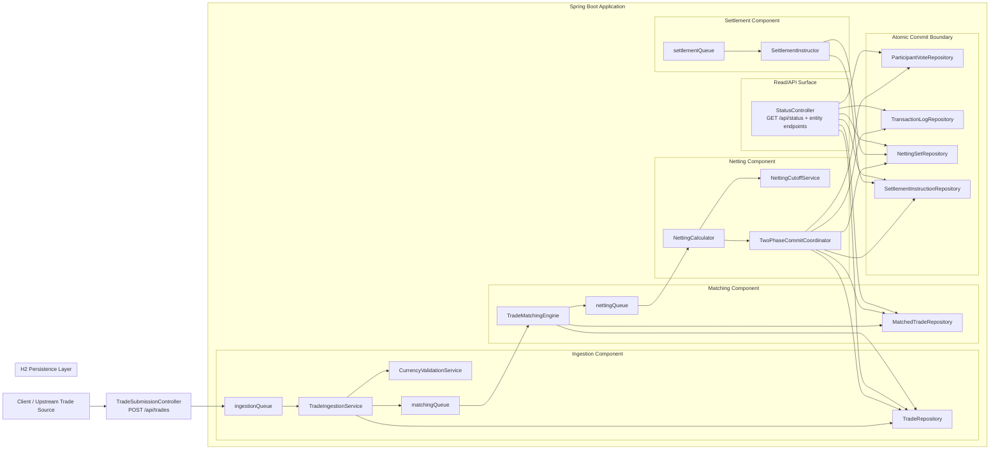

# CLSNet Mock

Mock implementation of a CLSNet-style bilateral FX payment netting pipeline built with Spring Boot, H2, and in-process worker queues.

## Overview

This repository models a multi-component post-trade processing system inside a single deployable application. Trades are submitted as FpML-like XML, validated and persisted, asynchronously matched into bilateral pairs, then passed through a two-phase commit step that atomically creates netting sets and settlement instructions.

The system is organized around cooperating components rather than separate microservices:

- `TradeSubmissionController` accepts XML trade submissions over HTTP.
- `TradeIngestionService` parses, validates, and stores incoming trades.
- `TradeMatchingEngine` pairs compatible buyer/seller trades.
- `NettingCalculator` drives the netting stage.
- `TwoPhaseCommitCoordinator` coordinates atomic netting + settlement generation.
- `SettlementInstructor` exists as a settlement worker for queue-driven or standalone settlement work, while the primary path creates instructions during the 2PC commit.
- `StatusController` exposes pipeline state, transaction log, and vote history.

## System Structure



## Processing Flow

1. A client submits an XML trade to `/api/trades`.
2. The controller places the raw payload on `ingestionQueue`.
3. `TradeIngestionService` parses the message, validates currencies and amounts, persists the trade, and forwards the internal trade id to `matchingQueue`.
4. `TradeMatchingEngine` finds the opposite-side trade, marks both records as matched, creates a `MatchedTrade`, and forwards that id to `nettingQueue`.
5. `NettingCalculator` starts a transaction through `TwoPhaseCommitCoordinator`.
6. The coordinator runs a prepare phase for the netting and settlement participants, records participant votes, and writes transaction log state.
7. On commit, the coordinator atomically creates two `NettingSet` records and the corresponding `SettlementInstruction` records, then updates the matched trades to `NETTED`.

## Repository Layout

- [`src/main/java/com/cit/clsnet/controller`](./src/main/java/com/cit/clsnet/controller): HTTP entry points and status APIs
- [`src/main/java/com/cit/clsnet/service`](./src/main/java/com/cit/clsnet/service): pipeline workers, validation, cutoff logic, and 2PC coordinator
- [`src/main/java/com/cit/clsnet/repository`](./src/main/java/com/cit/clsnet/repository): JPA persistence layer
- [`src/main/java/com/cit/clsnet/model`](./src/main/java/com/cit/clsnet/model): domain entities and enums
- [`src/main/java/com/cit/clsnet/config`](./src/main/java/com/cit/clsnet/config): queue and thread-pool configuration plus bound properties
- [`src/main/java/com/cit/clsnet/xml`](./src/main/java/com/cit/clsnet/xml): XML message mapping classes
- [`src/test/java/com/cit/clsnet`](./src/test/java/com/cit/clsnet): end-to-end and concurrency/load tests

## Running Locally

```bash
mvn spring-boot:run
```

The default configuration uses:

- Java 17
- Spring Boot 3.2.5
- H2 file-backed database at `./data/coredb`
- Configurable worker pools for ingestion, matching, netting, and settlement

## Useful Endpoints

- `POST /api/trades`
- `GET /api/status`
- `GET /api/trades`
- `GET /api/matched-trades`
- `GET /api/netting-sets`
- `GET /api/settlement-instructions`
- `GET /api/transaction-log`
- `GET /api/participant-votes`
