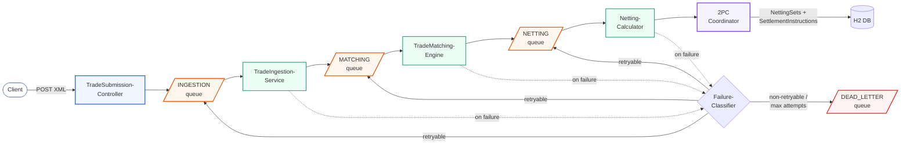
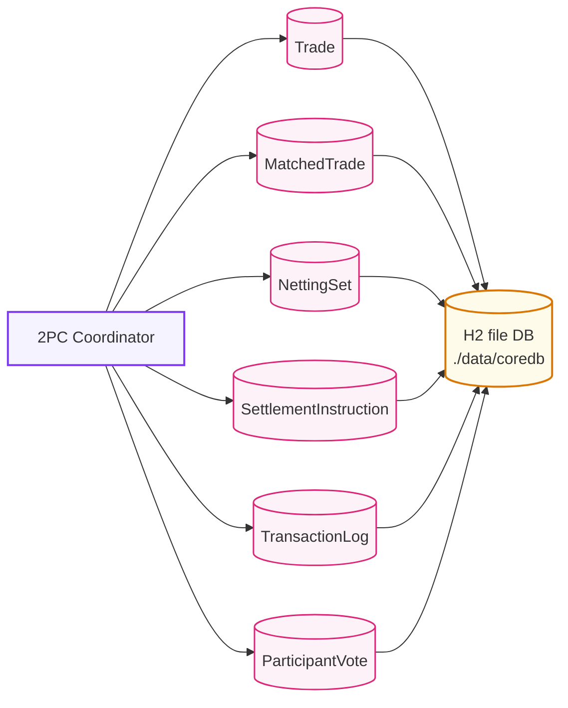
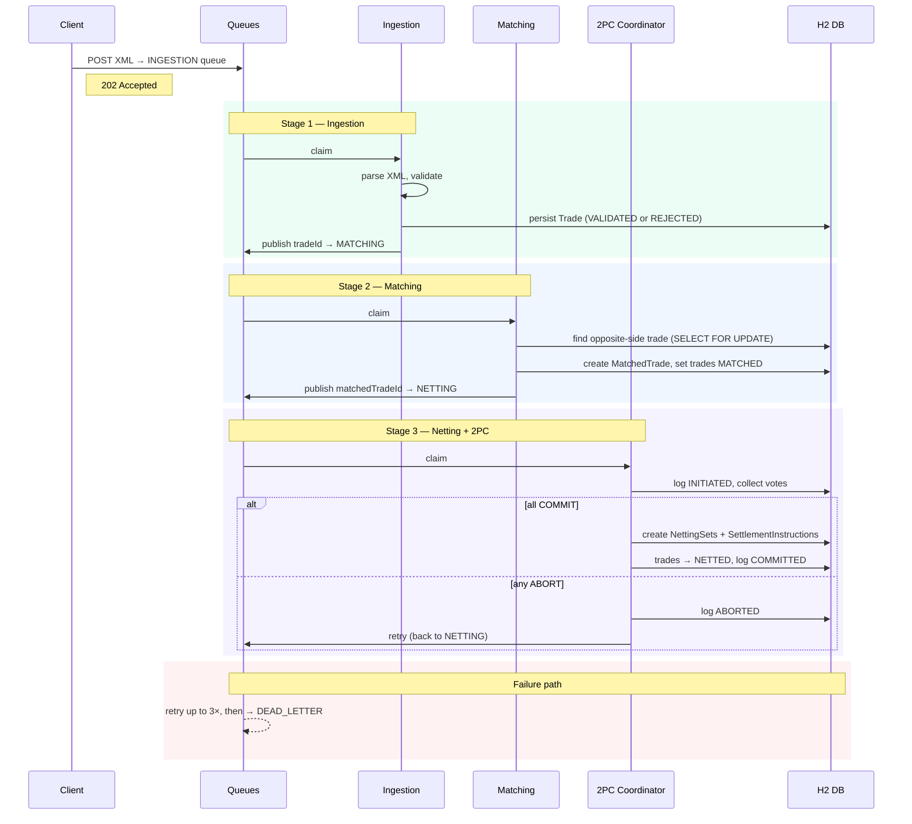

# CLSNet Mock (`mocknet/`)

Mock CLSNet-style bilateral FX payment netting pipeline: Spring Boot, H2, and a durable DB-backed message broker. All code and docs in this README refer to the [`mocknet/`](./mocknet/) Maven module.

## Overview

Trades are submitted as FpML-like XML, written to a durable ingestion queue, validated and stored, matched into bilateral pairs, then run through a two-phase commit that atomically creates netting sets and settlement instructions. Failed messages are classified, retried where possible, and routed to a dead-letter queue when retries are exhausted. OpenTelemetry tracing covers every queue stage and component method. Everything runs in one Spring Boot application.

### Components

| Component | Role |
|-----------|------|
| `TradeSubmissionController` | HTTP entry point — accepts FpML XML, enqueues on `INGESTION` |
| `TradeIngestionService` | Parse, validate, persist trades; advance to `MATCHING` queue |
| `CurrencyValidationService` | Checks currencies against a configurable allow-list |
| `TradeMatchingEngine` | Pair compatible buyer/seller trades with pessimistic locking |
| `NettingCalculator` | Netting stage — delegates to the 2PC coordinator |
| `NettingCutoffService` | Per-currency settlement cutoff times |
| `TwoPhaseCommitCoordinator` | Atomic prepare/commit: creates netting sets and settlement instructions |
| `SettlementInstructor` | Optional settlement worker on `SETTLEMENT` queue; primary path creates instructions during commit |
| `QueueBroker` | Durable queue manager — claim, complete, retry, dead-letter |
| `FailureClassifier` | Categorises exceptions into retryable/non-retryable failure reasons |
| `QueueMessageTracing` | OpenTelemetry spans for queue message lifecycle |
| `ComponentTracingAspect` | AOP tracing across controllers, services, and repositories |
| `StatusController` | Read-only endpoints: pipeline state, queues, transaction log, votes |

## Pipeline

Queues (orange) connect each stage. Every queue and repository is backed by the same H2 file database.



### Persistence layer

The 2PC coordinator writes to six repositories, all JPA-managed in the same H2 file database.



## Data flow



## Queue system

All queues are backed by the `queue_messages` table with optimistic locking (`@Version`).

| Queue | Producer | Consumer | Payload |
|-------|----------|----------|---------|
| `INGESTION` | TradeSubmissionController | TradeIngestionService | Raw FpML XML |
| `MATCHING` | TradeIngestionService | TradeMatchingEngine | `{"tradeId": <id>}` |
| `NETTING` | TradeMatchingEngine | NettingCalculator | `{"matchedTradeId": <id>}` |
| `SETTLEMENT` | (optional path) | SettlementInstructor | settlement payload |
| `DEAD_LETTER` | QueueBroker (on final failure) | — (manual recovery) | original payload + error context |

**Message lifecycle:** `NEW` → `PROCESSING` → `DONE` or `FAILED`

**Retry policy:** up to 3 attempts, 500 ms fixed backoff, 30 s stale-claim timeout. Retryable errors (concurrency conflicts, transient DB failures) are rescheduled. Non-retryable errors (invalid XML, missing fields, data integrity) go to DLQ immediately.

**DLQ payload** includes `originalQueue`, `originalPayload`, `attempts`, `reasonCode`, `errorMessage`, and `failedAt`.

## Failure classification

`FailureClassifier` maps exceptions to a `FailureReason` code and a retryability flag:

| Exception type | Reason code | Retryable |
|---------------|-------------|-----------|
| `OptimisticLock` / `PessimisticLock` / `Deadlock` | `CONCURRENCY_CONFLICT` | yes |
| `TransientDataAccessException` | `TRANSIENT_DATA_ACCESS` | yes |
| `DataIntegrityViolationException` | `DATA_INTEGRITY_VIOLATION` | no |
| XML parse errors | `INVALID_XML` | no |
| Missing tradeId / party / currency / amount | `MISSING_*` | no |
| Unsupported currency, invalid amount | `UNSUPPORTED_CURRENCY`, `INVALID_AMOUNT` | no |
| 2PC abort | `TWO_PHASE_COMMIT_ABORTED` | yes |

## Tracing

Two complementary OpenTelemetry layers run across the pipeline:

1. **QueueMessageTracing** — wraps each queue-message processing cycle in a `QueueMessage.process` span. Records `queue.name`, `worker.name`, correlation IDs (`tradeId`, `matchedTradeId`, `nettingSetId`), and the processing outcome (`completed`, `rejected`, `retried`, `failed` with `failure.reason_code`).

2. **ComponentTracingAspect** (AOP) — intercepts every public component/repository bean under `com.cit.clsnet`. Tags each span with `cls.stage` (HTTP, INGESTION, MATCHING, NETTING, SETTLEMENT, DATABASE), `component.kind`, and any correlation IDs extracted from method arguments and return values.

## Processing flow (summary)

1. Client posts XML to `POST /api/trades`.
2. The controller stores a `QueueMessage` on the `INGESTION` queue.
3. `TradeIngestionService` claims the message, parses and validates, persists the trade, enqueues the trade id on `MATCHING`, marks ingestion `DONE`. Invalid trades are soft-rejected (persisted as `REJECTED`) or hard-failed (retried, then sent to DLQ).
4. `TradeMatchingEngine` claims a matching message, finds the opposite-side trade under pessimistic lock, creates `MatchedTrade`, enqueues on `NETTING`, marks matching `DONE`. If no counterparty exists yet the message completes silently.
5. `NettingCalculator` claims a netting message and opens work through `TwoPhaseCommitCoordinator`.
6. Prepare phase: `NettingCalculator` and `SettlementInstructor` validate and record `VOTE_COMMIT` or `VOTE_ABORT` in the participant-votes table.
7. On commit, the coordinator atomically creates `NettingSet` and `SettlementInstruction` rows, sets matched trades to `NETTED`, logs `COMMITTED`, and marks the netting message `DONE`. On abort, the message is retried.

## Layout under `mocknet/`

| Path | Role |
|------|------|
| [`mocknet/src/main/java/com/cit/clsnet/ingestion`](./mocknet/src/main/java/com/cit/clsnet/ingestion) | Trade submission, ingestion worker, and ingestion-local utilities |
| [`mocknet/src/main/java/com/cit/clsnet/matching`](./mocknet/src/main/java/com/cit/clsnet/matching) | Matching worker and matching-local utilities |
| [`mocknet/src/main/java/com/cit/clsnet/netting`](./mocknet/src/main/java/com/cit/clsnet/netting) | Netting worker, cutoff logic, 2PC coordination, and netting-local factories |
| [`mocknet/src/main/java/com/cit/clsnet/settlement`](./mocknet/src/main/java/com/cit/clsnet/settlement) | Settlement worker and settlement-local utilities |
| [`mocknet/src/main/java/com/cit/clsnet/queue`](./mocknet/src/main/java/com/cit/clsnet/queue) | Durable queue broker, queue tracing, and queue-local correlation utilities |
| [`mocknet/src/main/java/com/cit/clsnet/status`](./mocknet/src/main/java/com/cit/clsnet/status) | Read-only status endpoints and status assemblers |
| [`mocknet/src/main/java/com/cit/clsnet/shared/failure`](./mocknet/src/main/java/com/cit/clsnet/shared/failure) | Shared failure classification, queue retry/disposition, and processing exceptions |
| [`mocknet/src/main/java/com/cit/clsnet/repository`](./mocknet/src/main/java/com/cit/clsnet/repository) | JPA repositories (including `QueueMessageRepository`) |
| [`mocknet/src/main/java/com/cit/clsnet/model`](./mocknet/src/main/java/com/cit/clsnet/model) | Entities and enums |
| [`mocknet/src/main/java/com/cit/clsnet/config`](./mocknet/src/main/java/com/cit/clsnet/config) | Queues, threads, `ClsNetProperties` |
| [`mocknet/src/main/java/com/cit/clsnet/xml`](./mocknet/src/main/java/com/cit/clsnet/xml) | FpML-style XML mapping |
| [`mocknet/src/main/resources`](./mocknet/src/main/resources) | `application.yml`, sample trades |
| [`mocknet/src/test/java/com/cit/clsnet`](./mocknet/src/test/java/com/cit/clsnet) | End-to-end and load tests |

Sample payloads: [`sample-trade-buy.xml`](./mocknet/src/main/resources/sample-trade-buy.xml), [`sample-trade-sell.xml`](./mocknet/src/main/resources/sample-trade-sell.xml).

## Run and test

From the repository root:

```bash
cd mocknet
mvn spring-boot:run
```

```bash
cd mocknet
mvn test
```

From the repository root, Bootstrap can prepare tracing and open a local CLS trace viewer:

```bash
bun install
bun run dev run "Use oteltrace for mocknet."
bash .bootstrap/otel/mocknet/start-jaeger.sh
bash .bootstrap/otel/mocknet/run-with-otel.sh
bun run dev run "Use traceview for mocknet and open the local viewer."
```

`traceview` writes local artifacts under `.bootstrap/traceview/mocknet/` and serves a localhost-only HTML viewer that polls Jaeger and renders CLS stages from the traces it finds.

Defaults (see [`mocknet/src/main/resources/application.yml`](./mocknet/src/main/resources/application.yml)):

- Java **17**, Spring Boot **3.2.5** ([`mocknet/pom.xml`](./mocknet/pom.xml))
- H2 file DB: `./data/coredb` (relative to the process working directory — use `mocknet/` when you run Maven there)
- Worker pool sizes under `clsnet.threads.*`
- Durable queues persisted as `queue_messages` via JPA
- H2 console enabled; HTTP port **8080**

## HTTP endpoints

- `POST /api/trades`
- `GET /api/status`
- `GET /api/trades`
- `GET /api/matched-trades`
- `GET /api/netting-sets`
- `GET /api/settlement-instructions`
- `GET /api/transaction-log`
- `GET /api/participant-votes`
- `GET /api/queues`
- `GET /api/queues/{queueName}/messages?status=...&limit=...`
