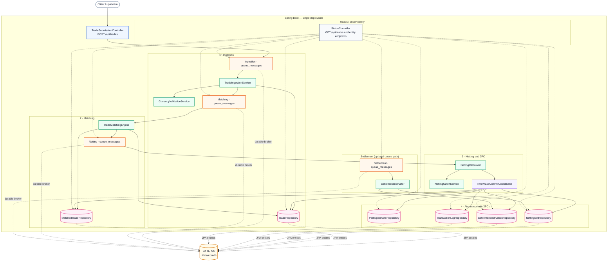

# CLSNet Mock (`mocknet/`)

Mock CLSNet-style bilateral FX payment netting pipeline: Spring Boot, H2, and a durable DB-backed message broker. All code and docs in this README refer to the [`mocknet/`](./mocknet/) Maven module.

## Overview

Trades are submitted as FpML-like XML, written to a durable ingestion queue, validated and stored, matched into bilateral pairs, then run through a two-phase commit that atomically creates netting sets and settlement instructions. Everything runs in one Spring Boot application.

Main pieces:

- `TradeSubmissionController` — XML trade submissions over HTTP.
- `TradeIngestionService` — parse, validate, persist trades; advance the pipeline via queues.
- `TradeMatchingEngine` — pair compatible buyer/seller trades.
- `NettingCalculator` — netting stage; delegates to the 2PC coordinator.
- `TwoPhaseCommitCoordinator` — atomic netting + settlement generation.
- `SettlementInstructor` — optional settlement worker on `settlementQueue`; primary path creates instructions during commit.
- `StatusController` — pipeline state, transaction log, vote history, and queue inspection.

## System structure



## Processing flow

1. Client posts XML to `POST /api/trades`.
2. The controller stores a `QueueMessage` on the `INGESTION` queue.
3. `TradeIngestionService` claims the message, parses and validates, persists the trade, enqueues the internal trade id on `MATCHING`, marks ingestion `DONE`.
4. `TradeMatchingEngine` claims a matching message, pairs trades, creates `MatchedTrade`, enqueues on `NETTING`, marks matching `DONE`.
5. `NettingCalculator` claims a netting message and opens work through `TwoPhaseCommitCoordinator`.
6. Prepare phase records participant votes and transaction log state.
7. On commit, the coordinator creates `NettingSet` and `SettlementInstruction` rows, sets matched trades to `NETTED`, marks the netting message `DONE`.

## Layout under `mocknet/`

| Path | Role |
|------|------|
| [`mocknet/src/main/java/com/cit/clsnet/controller`](./mocknet/src/main/java/com/cit/clsnet/controller) | HTTP APIs |
| [`mocknet/src/main/java/com/cit/clsnet/service`](./mocknet/src/main/java/com/cit/clsnet/service) | Workers, `QueueBroker`, 2PC, validation, cutoff |
| [`mocknet/src/main/java/com/cit/clsnet/repository`](./mocknet/src/main/java/com/cit/clsnet/repository) | JPA repositories (including `QueueMessageRepository`) |
| [`mocknet/src/main/java/com/cit/clsnet/model`](./mocknet/src/main/java/com/cit/clsnet/model) | Entities and enums |
| [`mocknet/src/main/java/com/cit/clsnet/config`](./mocknet/src/main/java/com/cit/clsnet/config) | Queues, threads, `ClsNetProperties` |
| [`mocknet/src/main/java/com/cit/clsnet/xml`](./mocknet/src/main/java/com/cit/clsnet/xml) | FpML-style XML mapping |
| [`mocknet/src/main/resources`](./mocknet/src/main/resources) | `application.yml`, sample trades |
| [`mocknet/src/test/java/com/cit/clsnet`](./mocknet/src/test/java/com/cit/clsnet) | End-to-end and load tests |

Sample payloads: [`sample-trade-buy.xml`](./mocknet/src/main/resources/sample-trade-buy.xml), [`sample-trade-sell.xml`](./mocknet/src/main/resources/sample-trade-sell.xml).

## Run and test

From the repository root:

```bash
cd mocknet
mvn spring-boot:run
```

```bash
cd mocknet
mvn test
```

From the repository root, Bootstrap can prepare tracing and open a local CLS trace viewer:

```bash
bun install
bun run dev run "Use oteltrace for mocknet."
bash .bootstrap/otel/mocknet/start-jaeger.sh
bash .bootstrap/otel/mocknet/run-with-otel.sh
bun run dev run "Use traceview for mocknet and open the local viewer."
```

`traceview` writes local artifacts under `.bootstrap/traceview/mocknet/` and serves a localhost-only HTML viewer that polls Jaeger and renders CLS stages from the traces it finds.

Defaults (see [`mocknet/src/main/resources/application.yml`](./mocknet/src/main/resources/application.yml)):

- Java **17**, Spring Boot **3.2.5** ([`mocknet/pom.xml`](./mocknet/pom.xml))
- H2 file DB: `./data/coredb` (relative to the process working directory — use `mocknet/` when you run Maven there)
- Worker pool sizes under `clsnet.threads.*`
- Durable queues persisted as `queue_messages` via JPA
- H2 console enabled; HTTP port **8080**

## HTTP endpoints

- `POST /api/trades`
- `GET /api/status`
- `GET /api/trades`
- `GET /api/matched-trades`
- `GET /api/netting-sets`
- `GET /api/settlement-instructions`
- `GET /api/transaction-log`
- `GET /api/participant-votes`
- `GET /api/queues`
- `GET /api/queues/{queueName}/messages?status=...&limit=...`
