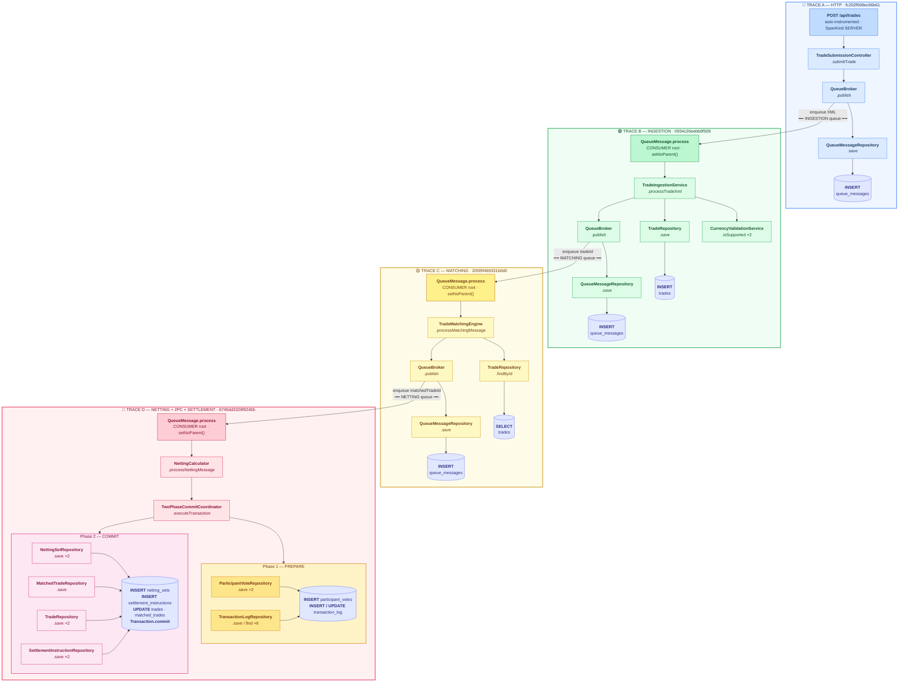
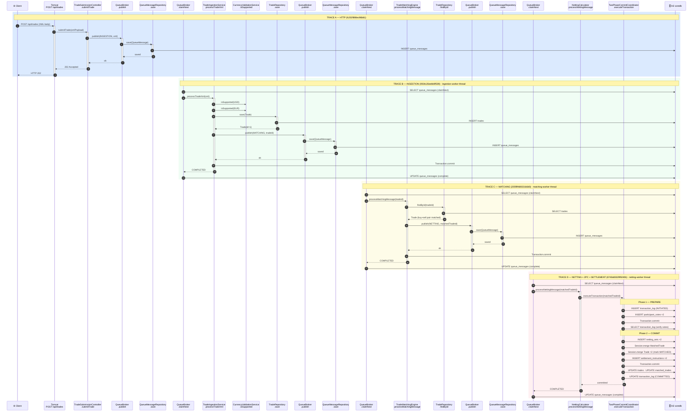

# mocknet Trace Flows

Diagrams derived from live Jaeger span data after submitting `sample-trade-buy.xml` and `sample-trade-sell.xml` through the full pipeline.

---

## Component Flow

---

## HTTP Sequence Flow

---

## Rendered PNGs

| Diagram | File |
|---|---|
| Component Flow | `mocknet-component-flow.png` |
| HTTP Sequence Flow | `mocknet-http-flow.png` |
