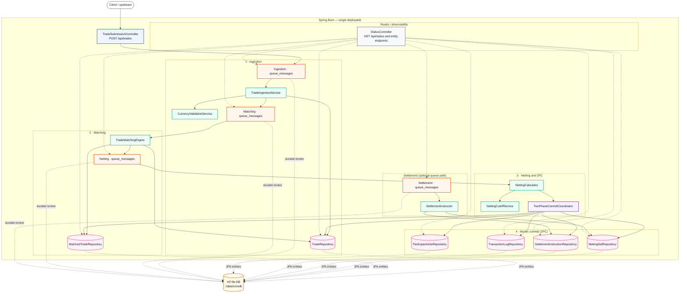

# CLSNet Mock

Mock implementation of a CLSNet-style bilateral FX payment netting pipeline built with Spring Boot, H2, and a durable DB-backed broker.

## Overview

This repository models a multi-component post-trade processing system inside a single deployable application. Trades are submitted as FpML-like XML, persisted to a durable ingestion queue, validated and stored, asynchronously matched into bilateral pairs, then passed through a two-phase commit step that atomically creates netting sets and settlement instructions.

The system is organized around cooperating components rather than separate microservices:

- `TradeSubmissionController` accepts XML trade submissions over HTTP.
- `TradeIngestionService` parses, validates, and stores incoming trades.
- `TradeMatchingEngine` pairs compatible buyer/seller trades.
- `NettingCalculator` drives the netting stage.
- `TwoPhaseCommitCoordinator` coordinates atomic netting + settlement generation.
- `SettlementInstructor` exists as a settlement worker for queue-driven or standalone settlement work, while the primary path creates instructions during the 2PC commit.
- `StatusController` exposes pipeline state, transaction log, and vote history.

## System Structure



## Processing Flow

1. A client submits an XML trade to `/api/trades`.
2. The controller persists the raw payload as a `QueueMessage` in the `INGESTION` queue.
3. `TradeIngestionService` claims the next ingestion message, parses and validates it, persists the trade, then publishes the internal trade id to the `MATCHING` queue and marks the ingestion message `DONE`.
4. `TradeMatchingEngine` claims a matching message, finds the opposite-side trade, marks both records as matched, creates a `MatchedTrade`, publishes that id to the `NETTING` queue, and marks the matching message `DONE`.
5. `NettingCalculator` claims a netting message and starts a transaction through `TwoPhaseCommitCoordinator`.
6. The coordinator runs a prepare phase for the netting and settlement participants, records participant votes, and writes transaction log state.
7. On commit, the coordinator atomically creates two `NettingSet` records and the corresponding `SettlementInstruction` records, then updates the matched trades to `NETTED` and marks the netting message `DONE`.

## Repository Layout

- [`src/main/java/com/cit/clsnet/ingestion`](./src/main/java/com/cit/clsnet/ingestion): trade submission, ingestion worker, and ingestion-local utilities
- [`src/main/java/com/cit/clsnet/matching`](./src/main/java/com/cit/clsnet/matching): matching worker and matching-local utilities
- [`src/main/java/com/cit/clsnet/netting`](./src/main/java/com/cit/clsnet/netting): netting worker, cutoff logic, 2PC coordinator, and netting-local factories
- [`src/main/java/com/cit/clsnet/settlement`](./src/main/java/com/cit/clsnet/settlement): settlement worker and settlement-local utilities
- [`src/main/java/com/cit/clsnet/queue`](./src/main/java/com/cit/clsnet/queue): durable queue broker, tracing, and queue-local payload correlation
- [`src/main/java/com/cit/clsnet/status`](./src/main/java/com/cit/clsnet/status): status APIs and response assemblers
- [`src/main/java/com/cit/clsnet/shared/failure`](./src/main/java/com/cit/clsnet/shared/failure): shared failure classification and queue-processing exceptions
- [`src/main/java/com/cit/clsnet/repository`](./src/main/java/com/cit/clsnet/repository): JPA persistence layer
- [`src/main/java/com/cit/clsnet/model`](./src/main/java/com/cit/clsnet/model): domain entities and enums
- [`src/main/java/com/cit/clsnet/config`](./src/main/java/com/cit/clsnet/config): broker and worker-thread configuration plus bound properties
- [`src/main/java/com/cit/clsnet/xml`](./src/main/java/com/cit/clsnet/xml): XML message mapping classes
- [`src/test/java/com/cit/clsnet`](./src/test/java/com/cit/clsnet): end-to-end and concurrency/load tests

## Running Locally

```bash
mvn spring-boot:run
```

The default configuration uses:

- Java 17
- Spring Boot 3.2.5
- H2 file-backed database at `./data/coredb`
- Configurable worker pools for ingestion, matching, netting, and settlement
- Durable queue records stored in `queue_messages`

## Useful Endpoints

- `POST /api/trades`
- `GET /api/status`
- `GET /api/trades`
- `GET /api/matched-trades`
- `GET /api/netting-sets`
- `GET /api/settlement-instructions`
- `GET /api/transaction-log`
- `GET /api/participant-votes`
- `GET /api/queues`
- `GET /api/queues/{queueName}/messages?status=...&limit=...`
