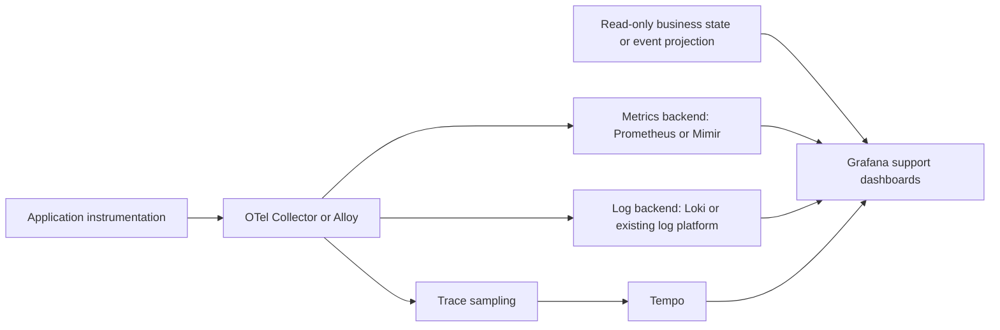

# Production L3 support dashboard assessment

> Historical baseline from the earlier trace-only setup. The L3 implementation and current limits are documented in [README.md](README.md) and [L3-VALIDATION.md](L3-VALIDATION.md).
Reviewed 2026-09-15 against the running Grafana view, its provisioned JSON, the telemetry pipeline configuration, and primary Grafana/OpenTelemetry/Google SRE documentation.

## Verdict

OTel and Grafana are suitable components for this goal. The current implementation is a trace explorer and a useful integration demo. It is not ready to serve as the primary production L3 support dashboard.

There is no universal checklist that certifies every service dashboard. The requirements below are a proposed acceptance contract for this queue-driven trade pipeline. Availability targets, incident lookback, throughput, access boundaries, and business deadlines must be defined for the deployment before production readiness can be established.

## Current findings

| Requirement | Assessment | Evidence and consequence |
| --- | --- | --- |
| Locate an individual execution | Working | HTTP and asynchronous consumer spans can be opened in Tempo through Grafana. |
| See overall service impact | Missing | Seven trace-search tables provide examples, not request rates, affected-operation counts, or completion latency distributions. |
| Read the first screen quickly | Needs redesign | At the inspected viewport, trace IDs dominate and tables scroll horizontally. Important diagnostic information is outside the visible columns. |
| Reconstruct attempts and final outcome | Partial | Retry spans exist, but the error panel includes recovered operations. An error event is not the same as terminal business failure. |
| Find work that never starts | Missing | A consumer trace can only appear after a worker starts. Backlog and oldest-message-age metrics are needed to detect stalled workers. |
| Configure common investigations without query syntax | Partial | Only a free-text TraceQL box and slow threshold exist. Service is hard-coded in six queries. There are no environment, instance, stage, or outcome selectors. |
| Correlate evidence | Partial | Trace links work. No log or metrics data sources are provisioned, and no related evidence links are configured. |
| Preserve incident context | Needs correction | Custom Explore links hard-code now-1h instead of preserving the selected incident interval. Trace lookup may still work, but investigation context is lost. |
| Show actual business completion | Partial | HTTP 202 proves acceptance. A SETTLEMENT-tagged span proves execution of that stage, not successful external settlement. Authoritative final state must be shown separately. |
| Recognize missing telemetry | Missing | An empty table does not distinguish inactivity from sampling, delayed export, collector failure, or expired retention. |
| Provide ownership, alerts and next steps | Missing | No symptom-based alert routing, deployment annotations, service owner, or diagnostic runbooks in the workflow. |
| Production access and resilience | Demo only | Anonymous Editor access, single-instance containers, local storage and 72-hour retention. The exporter buffer survived a tested outage, but this does not prove HA or cover collector pending-buffer loss. |
| Reproducible configuration | Good foundation | Provisioning files and dashboard JSON exist in the repository working tree. They still need review, CI, release ownership and promotion controls. |

Configuration evidence: `grafana/dashboards/mocknet.json`, `grafana/provisioning/datasources/tempo.yaml`, `collector.yaml`, `tempo.yaml`, `compose.yaml`, and `../script/mocknet-grafana.sh`. The launcher explicitly disables OTel metrics and log export.

Grafana recommends a focused overview with directed drilldowns and reusable variables. That supports replacing the current table-heavy landing page with the following investigation flow. [Dashboard guidance](https://grafana.com/docs/grafana/latest/visualizations/dashboards/build-dashboards/best-practices/)

## Proposed support workflow

### 1. Service overview: what is affected, and since when?

Controls: environment, service, deployment version, instance, region when applicable, time range, and business operation ID.

Show a compact summary followed by trends:

- Accepted operations, completed operations, terminal failures, recovered operations and pending operations. Define each population and denominator.
- End-to-end completion latency, separate from HTTP acceptance latency.
- Oldest pending message age, backlog by stage, retry rate and dead-letter growth.
- Active incidents, current release, recent deployments and telemetry freshness.

Organize the stage summary in the actual processing order: ingestion, matching, netting, settlement instruction creation. Each stage should show throughput, failure rate, processing latency and pending age. A stage diagram is an application workflow view. Do not label internal classes as independently deployed services.

For unmatched trades, pending a counterparty is a valid business state until the relevant deadline is breached. Do not automatically color every unmatched trade red.

Google SRE recommends prominent service-level indicators with supporting diagnostics that explain the cause. For this application, technical acceptance and business completion need different indicators. [Monitoring guidance](https://sre.google/workbook/monitoring/)

### 2. Stage diagnostics: where is progress slowing or failing?

Clicking a stage retains the same filters and incident time range. Show:

- Queue depth, oldest ready-message age, scheduled retry age and processing age.
- Active workers, throughput, completed/failed attempt rate and retry exhaustion.
- Processing latency distribution and dependency latency.
- JVM CPU, heap/GC, thread-pool saturation, database connection-pool utilization and waits.
- Error signatures grouped by operation and exception/reason, with first seen, last seen and relevant release.

Use metrics for population-level trends. Use representative trace links to inspect individual executions. Count logical operations separately from attempts and nested spans.

### 3. Operation investigation: what happened to this trade/message?

A trade ID or message ID should open a support view with:

- Authoritative current state and the timestamp/source of that state.
- Accepted time, last progress, current stage, terminal/recovered/pending outcome and total elapsed time.
- An attempt timeline, including queue delay, retry scheduling, processing and failure reason.
- All related trace IDs across retries, redelivery, replay and fan-in, rather than assuming the business operation always has one trace ID.
- The failed span, surrounding structured logs, dependency telemetry, and release/configuration context.
- Service ownership, the relevant runbook and a shareable incident link with an absolute time range.

Explicit producer/consumer context and span links should preserve asynchronous relationships. Both trades contributing to a matched trade need correlation. Follow the applicable OTel messaging conventions rather than inferring ancestry from timestamps. [Messaging span conventions](https://opentelemetry.io/docs/specs/semconv/messaging/messaging-spans/)

Grafana supports links from trace spans to logs, metrics and other systems. Use these to retain context through the investigation. [Trace correlations](https://grafana.com/docs/grafana/latest/datasources/tempo/configure-tempo-data-source/trace-correlations/)

## Telemetry and storage design

Recommended logical arrangement, adapted to existing production infrastructure:

OTel supplies and transports telemetry. Grafana queries data stores. Adding panels alone cannot provide the missing measurements.

### Metrics

Add direct counters, gauges and histograms for operation outcomes, queue depth/age, attempts, processing time and end-to-end time. Use one authoritative instrumentation path per measurement to avoid double-counting agent and custom spans.

Span-derived RED metrics are useful for server/consumer boundaries, but generate them before trace sampling. Metrics generated from retained error/slow traces produce a biased population. Direct business metrics are preferable for completion and backlog. Grafana explicitly documents metrics generation before tail sampling. [Sampling guidance](https://grafana.com/docs/opentelemetry/collector/sampling/tail/)

Use stable, bounded metric dimensions such as environment, service, stage and outcome. Trade IDs, message IDs, exception text and trace IDs belong in searchable event/trace fields, not unrestricted metric labels.

### Logs and business events

Emit structured logs with trace/span ID when a span exists, and operation/message ID across the entire lifecycle. Include stage, attempt, final outcome, error classification and instance/version. Redact sensitive fields before export. Retain enough surrounding logs to distinguish a reported reason from supporting evidence.

Business state must come from an authoritative read-only application interface or event projection. A sampled or expired trace cannot establish the absence of a transaction. Use a reporting projection if direct production lookups would be expensive or expose excessive data.

### Traces

Retain useful boundary and dependency spans. Limit duplicate repository layers and payload inspection. Preserve a representative successful population as well as errors, slow executions and incident-specific capture within the approved retention/cost policy.

The current sampling policy keeps all HTTP/message traces and removes successful standalone polling. It is not a production traffic-volume budget. Size the pipeline for expected peaks, long queue delays and late spans. Horizontal tail sampling needs consistent routing by trace ID.

### Production operations

- Replace anonymous editing with authenticated support access and least-privilege permissions appropriate to the selected Grafana edition. Filters are not security boundaries.
- Define encryption, secret management, retention, redaction and access auditing.
- Select storage and availability architecture against actual outage/recovery requirements. A managed backend is an option; a new large self-hosted cluster is not automatically necessary.
- Monitor the telemetry system itself: export failures, queue capacity, dropped/refused data, sampling decisions, ingestion lag and query failures.
- Version dashboards, data sources, alerts, runbooks and schema changes. Test in staging and promote reviewed releases.

Exporter persistence helps with outages but does not eliminate data loss from queue exhaustion or disk failure. OTel recommends monitoring exporter queue size/capacity and send failures. [Collector resiliency](https://opentelemetry.io/docs/collector/resiliency/)

## Readability and configurability rules for this service

- Put impact and the affected stage on the first screen. Put long trace IDs behind short links/copy controls.
- Show useful issue columns: last seen, operation ID, stage, final outcome, reason, attempt count and duration. Separate active terminal failures from recovered retries.
- Use labeled status colors consistently. Show unavailable/stale as a distinct state, not zero or healthy.
- Keep normal triage usable without TraceQL. Preserve an advanced query view for L3 exploration.
- Carry all relevant filters and an absolute incident interval through links. Make the selected timezone clear.
- Explain metric definitions, units, thresholds, source and time-window semantics in panel descriptions.
- Treat environment, stage and instance selectors as shared controls. Thresholds should come from the service's agreed objectives, not arbitrary demo values.
- Measure overview/query performance with realistic retention and concurrent support users. Avoid refreshing seven broad trace searches every ten seconds by default.

## Production acceptance tests

These are proposed tests, not completed certification. Agree on numeric performance and support-time targets with the service owners.

| Exercise | Required diagnostic result |
| --- | --- |
| HTTP 202 followed by async failure | Overview shows business failure despite successful HTTP acceptance; operation view identifies the actual failed attempt and stage. |
| Two retries followed by success | Count one recovered operation and three attempts; no terminal-failure misclassification. |
| Worker stopped before consuming | Backlog and oldest age rise; view identifies stalled stage even though no consumer span exists. |
| Real controlled database lock/pool exhaustion | Stage metrics expose waits; traces and logs provide evidence for the dependency bottleneck. An injected error label alone is insufficient. |
| Queue delay versus slow handler | Display waiting and execution time separately and identify the dominant contributor. |
| Duplicate delivery/replay/fan-in | Relate executions to the logical operation without double-counting business completion. |
| Telemetry interrupted | Show telemetry unavailable or stale, alert on export failure, and distinguish this from application health. |
| Collector/backend restart under load | Verify agreed loss/recovery limits, pending buffers, disk capacity and late spans. |
| Historical incident | Preserve time range and filters across every drilldown; return data within the required lookback period. |
| Access checks | Verify that support users can investigate authorized services and cannot use Explore or direct queries to cross restricted data boundaries. |
| Usability exercise | An L3 engineer unfamiliar with the injected incident can identify impact, stage, sequence and supporting evidence within the agreed time, without shell access or author assistance. |

## Implementation order

1. Define logical operation identity, outcome semantics, completion deadline and queue metrics.
2. Add metrics and structured logs; connect data sources and correlations.
3. Build the overview, stage and operation views with shared controls.
4. Add symptom-based alerts, runbooks, ownership and telemetry-health indicators.
5. Harden access/storage, test realistic load and incident lookback, and run the L3 acceptance exercises.

The existing trace explorer should become an advanced drilldown in that system. The production-readiness claim should follow measured operational and support acceptance, not just successful trace generation.
