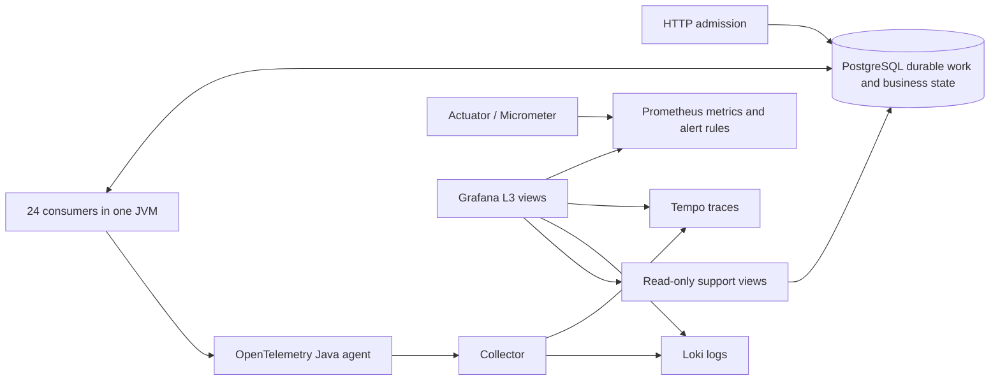

# Mocknet observability approaches

- [Approach A](approach-a/README.md): application-aware L3 diagnosis with traces, queue history, metrics and logs.
- [Approach B](approach-b/README.md): strictly OpenTelemetry JVM runtime metrics, with its own backend and metrics store.
- [Approach C](approach-c/README.md): Grafana with a Python support API, database/ODS source adapters, read-only L3 diagnostics and reconstructed log/journal timelines, with no Java agent.
- [Comparison and measured costs](APPROACH-COMPARISON.md): diagnostic coverage, application changes, storage and operating effort.

The instructions below describe Approach A.

A runnable support workflow with current business state, metrics, durable attempt history, traces, logs, and incident alerts. This is a production-oriented **local demonstration**, with explicit deployment limits below.

## Open and run

- [Service overview](http://localhost:3300/d/mocknet-traces): affected operations, failure reasons, queue delays and processing duration.
- [Stage diagnostics](http://localhost:3300/d/mocknet-stages): waiting versus processing, failure signatures, workers, database pool, JVM and telemetry health.
- [Operation investigation](http://localhost:3300/d/mocknet-operation): trade/operation lookup, both sides of a matched trade, durable attempts, embedded trace waterfall and correlated logs.

```bash
bun run mocknet:grafana start
bun run mocknet:grafana demo       # 15 business / trace scenarios
bun run mocknet:grafana l3-demo    # concurrent load, matched pairs, stalls, retries, DB pressure, Tempo outage, owned JVM crash
bun run mocknet:grafana check      # execute dashboard queries through Grafana
bun run mocknet:grafana status
bun run mocknet:grafana stream-start  # continuous mixed workload, 1 admission/second
bun run mocknet:grafana stream-status
bun run mocknet:grafana stream-stop
bun run mocknet:grafana stop       # preserves databases and telemetry volumes
```

Prerequisites: Docker Compose, Java 17, Maven, Bun, Python 3, curl and openssl. The L3 exercise deliberately interrupts **only this stack's Tempo and launcher-owned JVM**. Fault controls auto-expire. It creates a new unique run and retains existing data; it does not reset the database.

Backend: `http://localhost:18081/api/status`. Prometheus: `http://localhost:19090`. All host ports bind to loopback. Existing `mocknet/data/coredb` and the earlier H2 demo remain untouched by this launcher.

### Continuous dashboard feed

Use the [live overview](http://localhost:3300/d/mocknet-traces?from=now-15m&to=now&refresh=10s) with **Last 15 minutes** and a **10-second refresh**. A fixed historical interval will not show new submissions.

The detached feed continues after the terminal command returns. Each ten-request cycle sends six trades in three matching pairs, one unmatched trade, one slow trade, one retry that recovers, and one rotating fault (validation rejection, retry exhaustion, malformed XML). HTTP acceptance is counted separately from the eventual business outcome. Trace export and indexing lag admission; use the durable operation timeline for immediate progress.

Change the rate by stopping the feed, then running `MOCKNET_SEED_RATE=2 bun run mocknet:grafana stream-start` (allowed range 0.1–10 requests/second). Repeated starts reuse the existing process. `stream-stop` stops only the feeder; stack `stop` also stops it. Status and the last 30 submission IDs are in ignored `.bootstrap/observability/stream-status.json`.

The feed waits during backend outages and pauses at 1,000 unfinished queue messages, 100,000 retained admissions, or less than 2 GiB free on the host filesystem. It resumes when the condition clears. The disk guard does not measure Docker's internal virtual disk. It does not delete history or repeat POST requests whose outcome is uncertain.

### Coverage boundary

Stage diagnostics includes a **Queue inventory** for INGESTION, MATCHING, NETTING, SETTLEMENT and DEAD_LETTER, including empty queues. The active path has HTTP, queue publish/consume, explicit business-boundary and JDBC spans, plus durable attempts and correlated logs. Queue state remains visible without a consumer span.

The standard flow executes ingestion → matching → netting and generates settlement instructions inside netting. It does **not** enqueue the separate SETTLEMENT consumer. DEAD_LETTER is a parking queue with no consumer. Private methods and self-invocations do not each receive separate aspect spans. These are coverage limits; an empty queue or absent component span is not evidence that every code path has been tested.

See the [queue incident review](QUEUE-INCIDENT-REVIEW.md) for the researched design, live stall/recovery evidence and remaining production requirements.

## Demonstrating an incident

1. Start at the overview with an absolute incident time range. The first table keeps current unfinished work visible regardless of its admission time. Failures and rejections use the selected admission interval. An explicit ID searches all admissions. Details opens the operation from admission through now.
2. Compare failure reasons and time trends. The compact outcome table separates terminal failures, rejections and recovered operations. A 202 response is admission, not a completed trade.
3. Open stage diagnostics. Rising ready age with no handler spans points to consumers or admission to the database; long processing time points inside a handler. Inspect the database pool and alert history. Reachability and queue-data freshness remain in the telemetry section for diagnosing gaps in the evidence.
4. Click an operation ID, or paste a trade ID. Inspect the database's current state and `observed_at` / `last_progress_at` timestamps. This remains available even when Tempo is down.
5. The Trace ID selector lists traces for the selected operation and related matching work. Investigate links select the originating trace automatically; the full clickable ID is also the first column in Operation and trace. Read the persisted attempt timeline. Separate scheduled retry time (`available_at`), ready waiting, processing, retry reason and final outcome. Abandoned claims survive a JVM crash.
6. Click a trace ID for its embedded waterfall. Filter errors, inspect SQL timing, and read correlated logs. Top navigation and attempt trace links retain the selected interval; current-work Details links expand it to include admission through now. Related-operation links expose both sides of matching.

The operation page intentionally shows **current database state**, even if the selected interval is historical. Trace/log panels use the selected interval. It is not a reconstruction of database state as it was at that time.

## Data and counting rules

| Signal | Source and meaning |
| --- | --- |
| Accepted submissions | One durable INGESTION queue message / operation UUID per accepted request, selected by admission time |
| Completed operation | Trade NETTED, with local settlement instructions generated; no external settlement claim |
| Failed operation | A related non-DLQ queue message failed permanently |
| Rejected operation | Business validation rejected the trade |
| Awaiting counterparty | Validation and matching check finished; no counterpart exists yet |
| Recovered operations | Subset with retried processing that has drained without terminal failure; may still await a counterpart |
| Attempt rates / claim-to-disposition histograms | Micrometer measurements after the queue disposition transaction commits; independent of trace sampling |
| Queue depth / age | Database snapshot every 5 seconds, with a timestamp and failure metric; ready and scheduled retries are distinct |
| Attempt history | Persisted with queue claims/dispositions, including worker, version, reason and trace correlation |
| Logs | Java agent → OTLP Collector → Loki; trace, span, operation and trade IDs in structured metadata |
| Version annotations | First recorded worker attempt for each version, explicitly not an authoritative deployment event |

Metrics filters support environment, service, version, instance and stage. Business-state panels describe the **one local demo database**. Current backlog is independent of the admission interval; outcome summaries use it. Explicit operation lookup searches all admissions; version/instance metric filters do not erase causal history from the database. SQL result limits are stated in the provisioned queries (50–200 rows). Trace search is capped at 50 matches and is never used for totals.

No trade, operation, trace or queue-message ID is a metric label. Loki indexes only service and environment; high-cardinality IDs remain structured metadata. Grafana's database role can read only the `support` views, not raw XML, counterparties or queue payloads. The role has no write access, a 5-second statement timeout and at most four dashboard connections. Time-window indexes support queue arrivals and terminal departure queries. These SQL views need load testing at production retention and dashboard concurrency.

## Architecture and scale



Defaults: ingestion 8, matching 8, netting 6, settlement 2 workers; Hikari pool 16; 250 ms polling; 2-second connection-acquisition timeout; 30-second claim lease; 3 attempts. Work is durable and atomically claimed. Ingestion→matching and matching→netting handoffs share the business transaction. Re-delivery of an already persisted ingestion operation is idempotent; a completed netting result is recognized on re-delivery.

Configure before starting a stopped backend:

```bash
MOCKNET_INGESTION_WORKERS=12 MOCKNET_MATCHING_WORKERS=8 \
MOCKNET_NETTING_WORKERS=6 MOCKNET_SETTLEMENT_WORKERS=2 \
MOCKNET_DB_POOL=20 MOCKNET_INSTANCE=local-1 MOCKNET_VERSION=l3-demo-v3 \
  bun run mocknet:grafana start
```

This scales real concurrent consumers against PostgreSQL; it does not pretend the internal stages are independent microservices. The load runner exercises hundreds of requests and matching transactions. It is a bounded incident demonstration, not a production capacity certification or soak benchmark.

Pinned images: PostgreSQL 17.6, Prometheus 3.5.0, Loki 3.5.0, Tempo 2.9.0, Collector 0.147.0 and Grafana 12.4.1. Java agent 2.26.1 is checksum verified and attaches only to the application JVM. Production adoption must review supported versions and current security advisories.

## Configuration and operations

- Edit `script/build-mocknet-dashboards.py`, then regenerate with `python3 script/build-mocknet-dashboards.py`. Grafana reloads provisioned dashboards. They are maintained as code; viewers can change variables and time ranges.
- Alert thresholds are in `prometheus/alerts.yaml`. The short thresholds are for demonstration: ready age >10 s, pool waiters >0, snapshot age >15 s. Rules include owner labels. Prometheus evaluates them; **external paging/contact points are not configured**.
- Generated admin, database, read-only reader and fault-control secrets are in ignored `.bootstrap/observability/grafana.env`, mode 0600. Grafana anonymous access is Viewer. Sign in as `demo-admin` for administrative features; the embedded trace view works without Explore access.
- Fault endpoints require `X-Demo-Token` and the `observability-demo` profile: pause a named stage for 0–120 seconds; hold real Hikari connections for 1–30 seconds. These are test controls, not a support remediation API.
- Tempo/Loki retain 72 hours; Prometheus retains 72 hours or 2 GB. PostgreSQL retains the demonstration history until explicitly managed.
- Collector export queues persist on disk and retry. Tail-sampling decisions remain in memory: a collector crash can lose undecided traces. The local policy retains HTTP/consumer/error traces; sampling is not a source of business truth.
- API ports: 18081 backend, 18082 metrics, 15432 PostgreSQL, 14318 OTLP, 13133 collector health, 3200 Tempo, 13100 Loki, 19090 Prometheus, 3300 Grafana.

## Before a real production rollout

The tested L3 workflow is in place. Deployment readiness still requires:

- SSO/RBAC, TLS, tenant boundaries and audited support access; disable anonymous access and the fault profile.
- HA for the app and telemetry stores, supported versions, backups/restore tests, schema migrations and retention/archival for business/attempt history.
- Agreed traffic targets, latency/error SLOs, paging routes and escalation owners; sustained load and failure testing on the target infrastructure.
- Trace sampling budgets and resource limits; redact sensitive exception/log attributes. Direct queue snapshots and read-only SQL views need a reporting projection/read replica when retention or volume makes them costly.
- Safe lease renewal/fencing for handlers that can exceed the 30-second lease, stronger matching criteria/locking and full concurrent/replay semantics before real FX processing. The coordinator is an in-process simulation, not distributed two-phase commit across remote services.
- A real L3 operator acceptance exercise: diagnose an unfamiliar incident using the dashboard and record the time and missing context.

## Evidence and design references

See [L3 validation](L3-VALIDATION.md), [initial trace review](REVIEW.md) and [original L3 gap assessment](L3-DASHBOARD-ASSESSMENT.md). Raw scenario outcomes, admissions, query checks and logs are under ignored `.bootstrap/observability/`.

The hierarchy and diagnostic metrics follow [Grafana dashboard practices](https://grafana.com/docs/grafana/latest/visualizations/dashboards/build-dashboards/best-practices/) and [Google SRE monitoring guidance](https://sre.google/workbook/monitoring/). Metrics use [Spring Boot's supported instrumentation](https://docs.spring.io/spring-boot/docs/3.2.x/reference/html/actuator.html). Logs use [Loki native OTLP ingestion](https://grafana.com/docs/loki/latest/send-data/otel/native_otlp_vs_loki_exporter/). Queue durability follows the limits described in [OTel Collector resiliency](https://opentelemetry.io/docs/collector/resiliency/).

## Following a trace to its logs

In Approach A investigation, expand a span and click **Logs for this span**. Grafana Explore opens the Loki datasource with the trace ID and the span's time window, padded by one minute. Expand a log row to see the operation ID, queue, attempt, outcome and failure reason.

The local Grafana 12.4.1 container enables `GF_USERS_VIEWERS_CAN_EDIT=true` so anonymous support viewers can enter Explore. Without it, the built-in trace-to-logs link redirects Viewer sessions to Home. Viewer dashboard saves remain disallowed. This setting is deprecated upstream; for a production deployment use authenticated support accounts and the appropriate Explore permission for the deployed Grafana edition. See [Grafana Explore access](https://grafana.com/docs/grafana-cloud/learn-and-build/visualizations/explore/get-started-with-explore/).

Verified the actual span link in the browser after the change: Explore displayed four log records with the selected incident's trace ID, covering two ingestion retries, successful ingestion and matching. Evidence is saved locally in `.bootstrap/observability/log-link-validation.json`.

The [trace and data review](approach-a/TRACE-DATA-REVIEW.md) records the concise A instrumentation, counting rules, timing boundaries, and current A/C validation.

## Built-in Traces Drilldown

Grafana's Drilldown > Traces page runs TraceQL metrics queries such as `rate()` and `histogram_over_time(duration)`. Tempo 2.9 requires the metrics generator with `local-blocks`, in addition to its trace store. `tempo.yaml` enables it with persistent local storage, all span kinds, and historical block flushing. No additional span-derived counters are exported into the application's Prometheus metrics.

Run `python3 script/check-mocknet-traces-drilldown.py` after fresh traffic reaches the generator. This separately checks root/all-span rates, error rate, duration histogram, p90 and Grafana's datasource API. The ordinary dashboard query checker alone does not cover this plugin.

The generator was first enabled locally at 2026-09-15 17:57 UTC. Earlier traces remain searchable, but newly generated metric history does not backfill that earlier period. Root-span errors reflect root span status, usually HTTP admission here; they do not represent final asynchronous trade outcomes. All-spans rate counts component/SQL/consumer spans, not distinct operations. Use the service dashboard's committed operation and attempt history for business counts.

Configuration follows the [Tempo 2.9 TraceQL metrics instructions](https://github.com/grafana/tempo/blob/v2.9.0/docs/sources/tempo/metrics-from-traces/metrics-queries/configure-traceql-metrics.md).
