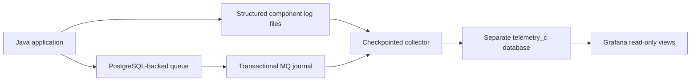

# Approach C: component logs and MQ journals

Approach C reconstructs service activity from structured component logs and committed queue journals. The application runs without a Java agent. Grafana queries a separate reporting database populated by our collector. No OpenTelemetry spans, trace-derived metrics, business database queries from Grafana, or JVM metrics supply C panels.

## Open

- [Service evidence overview](http://localhost:3302/d/mocknet-c-overview)
- [Queue journal diagnostics](http://localhost:3302/d/mocknet-c-queues)
- [Reconstructed operation](http://localhost:3302/d/mocknet-c-investigation)
- [Comparison and measured application cost](../APPROACH-COMPARISON.md)

The overview starts with operations, waiting work, failure reasons and component timings. Operation IDs link to a time window around the operation. Investigation combines component execution, queue wait and processing intervals, retries, parent call IDs and the original source records. No stat-card grid is used.

## Data path



This repository models MQ using PostgreSQL. The journal adapter captures its queue and durable attempt tables with transaction-local triggers. It is not an IBM MQ recovery-log reader. For IBM MQ, use supported activity/accounting records and a broker-specific adapter; do not assume proprietary recovery journals expose the same fields. IBM describes application activity trace as a more detailed diagnostic source than its other monitoring sources. [IBM MQ application activity trace](https://www.ibm.com/docs/en/ibm-mq/10.0.x?topic=network-application-activity-trace)

## Run and control

C has its own Grafana on port 3302. A uses port 3300. Start C with:

```bash
bash script/mocknet-approach-c.sh start
bash script/mocknet-approach-c.sh stream-start
bash script/mocknet-approach-c.sh status
.bootstrap/observability/approach-c/venv/bin/python script/mocknet-approach-c-demo.py
.bootstrap/observability/approach-c/venv/bin/python script/check-mocknet-approach-c.py
```

`bun run mocknet:grafana:c` is an alias for the launcher. Stop only its feed with `stream-stop`; stop only collection with `reporter-stop`. Use `reporter-start` to catch up. `stop` stops C's application, feed, collector, Grafana and PostgreSQL containers. A and B remain independent.

C uses Grafana port 3302, application port 18101, management health port 18102 and PostgreSQL port 15452. Host ports bind to loopback. PostgreSQL hosts distinct application and reporting databases. The JVM has a 128 MiB initial heap, 512 MiB maximum, 24 consumers and 16 application database connections. The reporter uses two persistent connections and batches up to 500 journal entries and 1,000 lines per file per pass. Its local state is under `.bootstrap/observability/approach-c/`.

Regenerate dashboards with `python3 script/build-mocknet-approach-c.py`. Provisioned JSON, SQL definitions and log configuration live in this directory. Runtime logs, generated secrets and experiment outputs stay under `.bootstrap/`.

## Reconstructed waterfall

Investigation uses the same native Grafana Traces panel as Approach A. `c_waterfall(operation_id)` converts stored reporting evidence into Grafana's trace frame at query time. It needs no agent, OTel export, Tempo instance or extra application instrumentation.

The waterfall fits the selected operation automatically, even when the dashboard covers 15 minutes. It provides nested, collapsible rows, duration bars, an overview, error filtering and expandable attributes. Stage names supply the renderer's service colors; the displayed service count is a count of evidence/stage groups, not separate deployed services.

- Component nesting follows recorded `parent_call_id` values.
- A top-level call joins an attempt only when message ID, worker and time interval identify exactly one attempt. The attributes identify this inferred relationship.
- Attempt groups contain retry delay, ready wait and processing. Retry delay is the interval from the previous retry's recorded finish to the next recorded ready time.
- Expanded rows show original call/message/attempt IDs, worker, outcome, failure reason and evidence source.
- Missing parents attach to the operation with a warning. Missing start/end records remain marked; open bars extend only to the collector's observation time. Negative clock intervals produce warnings.

Grafana calls these display rows spans. Their trace and span IDs are deterministic reconstruction IDs, not emitted OTel IDs. The synthetic operation/attempt groups organize the evidence and do not assert transaction commit. The native critical-path calculation describes this reconstructed tree and cannot establish dependencies absent from the logs.

The raw record, attempt and MQ transition tables remain below the waterfall. The reporting function runs with Grafana's existing read-only database role.

Validation commands:

```bash
.bootstrap/observability/approach-c/venv/bin/python script/check-mocknet-c-waterfall.py
.bootstrap/observability/approach-c/venv/bin/python script/check-mocknet-approach-c.py
```

The first uses rolled-back reporting fixtures to check nesting, retry delays, unknown IDs, missing evidence and clock inconsistencies. The second checks all dashboard queries and the native trace frame's field types. Seven recorded scenarios, including a 20-second queue stall, were also checked. The browser displayed the retry example as 28 nested rows with two roughly 500 ms backoff bars.

Format reference: [Grafana trace frame contract](https://github.com/grafana/grafana/blob/v12.4.1/packages/grafana-data/src/types/trace.ts).

## Logging and correlation contract

`ComponentJournalAspect` records component entry/exit, a unique event ID, boot ID, sequence, call/parent IDs, timestamp, monotonic duration, thread, queue message ID and operation ID. It covers the ingestion, matching, netting and instruction-generation components and queue publication. It reuses the existing explicit queue processing context and durable operation IDs. This is application instrumentation implemented through logging; removing the agent does not remove the need for correlation.

Queue-claim errors get a failure record with the queue, timing, wrapper exception class and root-cause class. Such errors occur before the application owns a message, so they cannot honestly be assigned to a particular operation. Empty successful polls produce no records.

No trade payloads, counterparty details, arguments, SQL, credentials or exception messages enter the structured stream. Queue journals select explicit metadata fields and omit payloads and span/trace fields. Operation/business IDs are searchable fields in the reporting store, not high-cardinality metric labels. If forwarding these records to Loki, keep those IDs out of index labels. [Grafana label guidance](https://grafana.com/docs/loki/latest/get-started/labels/bp-labels/)

Logback uses an 8,192-entry asynchronous queue with discarding disabled. It blocks producers if full. This favors evidence retention at a measurable application cost; it is not lossless under process kill, disk failure or an exhausted flush deadline. Files rotate at 20 MB, with seven-day and 512 MB caps. Logback explicitly documents the choice between blocking and dropping when the queue fills. [Logback asynchronous appenders](https://logback.qos.ch/manual/appenders-async-sift.html)

## Collection guarantees and limits

- The journal insert commits or rolls back with the queue mutation. A component method returning is recorded separately and does not prove a business transaction committed.
- The collector queries unacknowledged journal entries, writes reporting data, then acknowledges source entries. Unique event IDs make replay idempotent. It does not use a high-water sequence alone, which could skip a lower ID committed later.
- File checkpoints commit with their reporting inserts. Partial last lines remain unread until complete; rotation follows file identity. Malformed records go into quarantine with an offset and hash, without storing their content.
- Parent/call IDs establish component nesting. Queue message IDs, operation IDs and publication records establish queue associations. Overlapping nested durations are inclusive and must not be added together.
- Missing starts/ends and internal sequence gaps stay visible. A lost tail, both halves of a call, or an entire file lost before discovery can still escape detection. A journal record can establish queue disposition even when logs are missing.
- Timestamps come from the application and database clocks. JVM durations use a monotonic clock. Multi-host deployments require clock synchronization and source identities; proximity in time alone does not establish causality.
- Collector age over ten seconds means current-state views may be stale. Queue graphs sample reconstructed state every five seconds. A collector outage produces a gap; the implementation does not invent historical queue-depth samples while it was offline.
- Hourly maintenance removes detailed reporting history and acknowledged source journal records older than 72 hours. Latest queue/attempt records remain for current-state context; unacknowledged journal records remain pending. This is not a regulatory archive.

Grafana's `grafana_c` role has read-only reporting access, a ten-second query timeout, and no permission to connect to the application database. The collector's source role can read, acknowledge and prune the dedicated journal, and cannot read business tables. Its reporting role owns only the reporting database. Local generated passwords are outside version control.

## What L3 can and cannot establish

C can establish queue disposition, ready wait, worker ownership, retries, reason codes, component execution, exception types and collection gaps. It can distinguish twenty seconds waiting for ingestion from milliseconds spent processing.

C has no JVM heap/GC view, no automatic JDBC spans or SQL text, no HTTP dependency trace, and no thread dump. It does not reconstruct the external settlement system or a complete matched-pair business lifecycle. `queue work finished` means the observed queue work finished. It does not mean the trade settled. The separate SETTLEMENT queue is idle in the seeded workflow; instruction generation occurs inside NETTING.

Before production rollout, validate the real broker adapter and clocks, load-test the reporting queries and retention, test disk-full and ungraceful-kill behavior, and integrate the store with managed authentication, backups and alerting. The local demonstration and recovery checks do not certify a production deployment.
