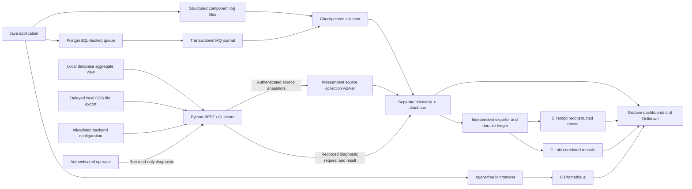

# Approach C: support backend, source adapters and Grafana

Approach C combines reconstructed log/journal evidence with a Python/Gunicorn support backend for database, ODS, configuration and read-only L3 diagnostics. Grafana queries a separate reporting database populated by our collector. The application runs without a Java agent. A separate exporter sends reconstructed traces to C Tempo and correlated records to C Loki; agent-free Micrometer supplies C Prometheus. Grafana queries those stores and the reporting database, never the business database.

This adapts the Citrix slide "Tech Stack – Approach C (draft for discussion)" in "Architect Input-USP Service Dashboard", keeping Grafana and the reporting store. Database access uses an aggregate view of the local Mocknet application. ODS is an explicitly labelled, delayed local export. COR, LG2 and UDG are shown as not configured; no corporate schema mapping or connection is claimed. Alarm and notification integration is outside this implementation.

## Open

- [Dashboard screenshots captured September 29, 2026](screenshots/2026-09-29/README.md)
- [Trade operations home](http://localhost:3302/d/mocknet-c-business)
- [Selected process timeline](http://localhost:3302/d/mocknet-c-process)
- [Business milestones, SLA rules and retention](BUSINESS-PROCESS.md)
- [Service evidence overview](http://localhost:3302/d/mocknet-c-overview)
- [Queue journal diagnostics](http://localhost:3302/d/mocknet-c-queues)
- [Reconstructed operation](http://localhost:3302/d/mocknet-c-investigation)
- [Sources and L3 diagnostics](http://localhost:3302/d/mocknet-c-sources)
- [Runtime and queue metrics](http://localhost:3302/d/mocknet-c-runtime)
- [Trace, log and metric parity: implementation and validation](telemetry/README.md)
- [Backend API, access and deployment](backend/README.md)

The overview starts with operations, waiting work, failure reasons and component timings. Operation IDs link to a time window around the operation. Investigation combines component execution, queue wait and processing intervals, retries, parent call IDs and the original source records. No stat-card grid is used.

## Data path



This repository models MQ using PostgreSQL. The journal adapter captures its queue and durable attempt tables with transaction-local triggers. It is not an IBM MQ recovery-log reader. For IBM MQ, use supported activity/accounting records and a broker-specific adapter; do not assume proprietary recovery journals expose the same fields. IBM describes application activity trace as a more detailed diagnostic source than its other monitoring sources. [IBM MQ application activity trace](https://www.ibm.com/docs/en/ibm-mq/10.0.x?topic=network-application-activity-trace)

## Run and control

C has its own Grafana on port 3302. A uses port 3300. Start the loopback-only local demo with:

```bash
bash script/mocknet-approach-c.sh start
bash script/mocknet-approach-c.sh seed
bash script/mocknet-approach-c.sh status
.bootstrap/observability/approach-c/venv/bin/python script/check-mocknet-approach-c.py
```

`seed` admits one bounded HTTP batch over about 64 seconds on its first run. It creates healthy matched pairs, counterparty waits, late matches, a late instruction, a rejection and retry outcomes. Later invocations reuse the latest verified manifest without admitting more trades. Use `seed --new-run` only to deliberately create another batch. The run manifest under `.bootstrap/observability/approach-c/seeds/` records operation IDs, fixed-time links and outcomes observed in the reporting store. Admissions have unique business IDs; the command never clears existing data or replays an uncertain POST. A new batch accepts `--healthy-pairs 0..60` and defaults to 40 additional pairs. New admissions require the local demo JVM profile and fixed loopback destination.

After a verified seed, generated local-demo dashboards use its absolute time window with auto-refresh off. The full panel check uses operations from that manifest and the same window, so a completed seed does not fail simply because it is over 20 minutes old. Production dashboards retain relative time ranges. This pins the view, not storage retention or live diagnostic state; normal retention policies still apply to stored telemetry.

`bun run mocknet:grafana:c` is an alias for the launcher. `stream-start` is an optional continuous feed; use `stream-stop` to stop it. Stop only collection with `reporter-stop`. Use `reporter-start` to catch up. `telemetry-stop` and `telemetry-start` control trace/log export independently. `stop` stops C's application, feed, workers and all C containers. A and B remain independent.

Local demo mode is explicit in the launcher. It gives anonymous users Viewer access on the loopback Grafana port and enables the application's demo fault profile for the two retry cases. Viewers cannot edit provisioned dashboards.

## Production configuration boundary

The production Compose overlay closes anonymous Grafana access and requires HTTPS with a certificate and unencrypted private key that match the configured hostname. The launcher checks certificate expiry, hostname and key correspondence before it starts services. It also disables the application's demo fault profile. Start it only after provisioning `.bootstrap/observability/grafana.env` with distinct secrets:

```bash
export MOCKNET_C_MODE=production
export MOCKNET_C_GRAFANA_ROOT_URL=https://grafana.example.com/
export MOCKNET_C_GRAFANA_CERT=/absolute/path/to/grafana.crt
export MOCKNET_C_GRAFANA_KEY=/absolute/path/to/grafana.key
export MOCKNET_C_INSTANCE=trade-observability-1
export MOCKNET_C_VERSION=your-release-version
bash script/mocknet-approach-c.sh production-check
bash script/mocknet-approach-c.sh start
```

Replace the example hostname with the certificate's actual DNS name. The key must be readable by the Grafana container user, and the certificate chain must be trusted by the host running the launcher. The HTTPS health check verifies the chain and hostname through the loopback listener. Grafana still binds to `127.0.0.1:3302`; place an authenticated ingress in front of it before allowing remote users. Secure cookies and HSTS are enabled in the overlay. Docker service ports bind to loopback. The JVM management endpoint on port 18102 is reachable from Docker's host gateway for Prometheus scraping; restrict it with host firewall rules before deployment. The launcher refuses to mix a running local-demo JVM with production mode; stop C first when changing modes. Production mode uses Hibernate schema validation, so a managed application schema must already exist. See Grafana's [HTTPS setup](https://grafana.com/docs/grafana/latest/setup-grafana/set-up-https/) and [security hardening](https://grafana.com/docs/grafana/latest/setup-grafana/configure-security/configure-security-hardening/) guides.

This overlay hardens the local Grafana runtime and separates production telemetry labels. It does not provision an ingress, individual user identity, SSO, managed secrets, encrypted PostgreSQL connections, backups, isolated production data volumes or real database/ODS/broker adapters. Those remain deployment requirements before claiming production readiness. The bundled demo data, fake retry faults and `seed` command belong only to local-demo mode.

C uses Grafana port 3302, application port 18101, management health port 18102, support REST port 18103 and PostgreSQL port 15452. Tempo uses 3202 (OTLP HTTP 24318), Loki 13102 and Prometheus 19092. Management port 18102 also exposes the Prometheus scrape. Docker-published ports bind to loopback. PostgreSQL hosts distinct application and reporting databases. The JVM has a 128 MiB initial heap, 512 MiB maximum, 24 consumers and 16 application database connections. The journal/log reporter uses two persistent connections and batches up to 500 journal entries and 1,000 lines per file per pass. Source collection uses a separate worker and reporting connection, so an unavailable REST backend cannot block journal ingestion. Its local state is under `.bootstrap/observability/approach-c/`.

The backend samples sources on request. The collector requests snapshots every ten seconds and exports the local ODS substitute every thirty seconds. The source dashboard shows source time, collection time, last successful read and errors. Failed adapters retain clearly labelled last known values; a stopped source collector becomes stale after 45 seconds. These snapshots add business database evidence without changing the origin of the log/journal waterfall.

Regenerate dashboards with `python3 script/build-mocknet-approach-c.py`. Provisioned JSON, SQL definitions and log configuration live in this directory. Runtime logs, generated secrets and experiment outputs stay under `.bootstrap/`.

## Reconstructed waterfall

Investigation uses the same native Grafana Traces panel as Approach A. `c_waterfall(operation_id)` converts stored reporting evidence into Grafana's trace frame at query time. This current evidence view remains independent of Tempo availability; the indexed waterfall below it reads the separately exported snapshot.

The waterfall fits the selected operation automatically, even when the dashboard covers 15 minutes. It provides nested, collapsible rows, duration bars, an overview, error filtering and expandable attributes. All rows belong to the single deployed service `mocknet`; internal stages use the `component.stage` attribute.

- Component nesting follows recorded `parent_call_id` values.
- A top-level call joins an attempt only when message ID, worker and time interval identify exactly one attempt. The attributes identify this inferred relationship.
- Attempt groups contain retry delay, ready wait and processing. Retry delay is the interval from the previous retry's recorded finish to the next recorded ready time.
- Expanded rows show original call/message/attempt IDs, worker, outcome, failure reason and evidence source.
- Missing parents attach to the operation with a warning. Missing start/end records remain marked; open bars extend only to the collector's observation time. Negative clock intervals produce warnings.

Grafana calls these display rows spans. Their trace and span IDs are deterministic reconstruction IDs shared with the collector-generated OTLP export; the application does not emit trace context. The synthetic operation/attempt groups organize the evidence and do not assert transaction commit. The native critical-path calculation describes this reconstructed tree and cannot establish dependencies absent from the logs.

The raw record, attempt and MQ transition tables remain below the waterfall. The reporting function runs with Grafana's existing read-only database role.

Validation commands:

```bash
.bootstrap/observability/approach-c/venv/bin/python script/check-mocknet-c-waterfall.py
.bootstrap/observability/approach-c/venv/bin/python script/check-mocknet-approach-c.py
```

The first uses rolled-back reporting fixtures to check nesting, retry delays, unknown IDs, missing evidence and clock inconsistencies. The second checks all dashboard queries and the native trace frame's field types. Seven recorded scenarios, including a 20-second queue stall, were also checked. The browser displayed the retry example as 28 nested rows with two roughly 500 ms backoff bars.

Format reference: [Grafana trace frame contract](https://github.com/grafana/grafana/blob/v12.4.1/packages/grafana-data/src/types/trace.ts).

## Logging and correlation contract

`ComponentJournalAspect` records component entry/exit, a unique event ID, boot ID, sequence, call/parent IDs, timestamp, monotonic duration, thread, queue message ID and operation ID. It covers the ingestion, matching, netting and instruction-generation components and queue publication. It reuses the existing explicit queue processing context and durable operation IDs. This is application instrumentation implemented through logging; removing the agent does not remove the need for correlation.

Queue-claim errors get a failure record with the queue, timing, wrapper exception class and root-cause class. Such errors occur before the application owns a message, so they cannot honestly be assigned to a particular operation. Empty successful polls produce no records.

No trade payloads, counterparty details, arguments, SQL, credentials or exception messages enter the structured stream. Queue journals select explicit metadata fields and omit payloads and span/trace fields. Operation/business IDs are searchable fields in the reporting store, not high-cardinality metric labels. The Loki exporter stores these IDs as structured metadata and JSON fields, outside index labels. [Grafana label guidance](https://grafana.com/docs/loki/latest/get-started/labels/bp-labels/)

Logback uses an 8,192-entry asynchronous queue with discarding disabled. It blocks producers if full. This favors evidence retention at a measurable application cost; it is not lossless under process kill, disk failure or an exhausted flush deadline. Files rotate at 20 MB, with seven-day and 512 MB caps. Logback explicitly documents the choice between blocking and dropping when the queue fills. [Logback asynchronous appenders](https://logback.qos.ch/manual/appenders-async-sift.html)

## Collection guarantees and limits

- The journal insert commits or rolls back with the queue mutation. A component method returning is recorded separately and does not prove a business transaction committed.
- The collector queries unacknowledged journal entries, writes reporting data, then acknowledges source entries. Unique event IDs make replay idempotent. It does not use a high-water sequence alone, which could skip a lower ID committed later.
- File checkpoints commit with their reporting inserts. Partial last lines remain unread until complete; rotation follows file identity. Malformed records go into quarantine with an offset and hash, without storing their content.
- Parent/call IDs establish component nesting. Queue message IDs, operation IDs and publication records establish queue associations. Overlapping nested durations are inclusive and must not be added together.
- Missing starts/ends and internal sequence gaps stay visible. A lost tail, both halves of a call, or an entire file lost before discovery can still escape detection. A journal record can establish queue disposition even when logs are missing.
- Timestamps come from the application and database clocks. JVM durations use a monotonic clock. Multi-host deployments require clock synchronization and source identities; proximity in time alone does not establish causality.
- Collector age over ten seconds means current-state views may be stale. Queue graphs sample reconstructed state every five seconds. A collector outage produces a gap; the implementation does not invent historical queue-depth samples while it was offline.
- Hourly maintenance retains MQ/business journal history for 90 days by default, configurable with `MOCKNET_BUSINESS_RETENTION_DAYS`. Technical logs and queue samples retain their 72-hour policy. Latest entity snapshots remain for current-state context; unacknowledged journal records remain pending. This is not a regulatory archive. See [business retention](BUSINESS-PROCESS.md).

Grafana's `grafana_c` role has read-only reporting access, a ten-second query timeout, and no permission to connect to the application database. The collector's source role can read, acknowledge and prune the dedicated journal, and cannot read business tables. Its reporting role owns only the reporting database. The backend's separate source reader can query only an approved aggregate view; its reporting reader can query approved diagnostic views, and its audit writer can insert/update diagnostic run records. Local generated passwords and distinct API reader/operator tokens are outside version control. These local service credentials are not enterprise SSO or individual user attribution.

## What L3 can and cannot establish

C can establish queue disposition, ready wait, worker ownership, retries, reason codes, component execution, exception types and collection gaps. It can distinguish twenty seconds waiting for ingestion from milliseconds spent processing.

C now has JVM heap/GC, CPU, HTTP and pool metrics, application logs, built-in Drilldown and recorded matched-leg navigation. It has no individual JDBC timing or SQL text, automatic HTTP dependency trace, or thread dump. It does not reconstruct the external settlement system. Matched legs and committed trade state describe local business processing only. `queue work finished` means the observed queue work finished. It does not mean the trade settled. The separate SETTLEMENT queue is idle in the seeded workflow; instruction generation occurs inside NETTING.

Before production rollout, validate the real database/ODS/broker adapters and clocks, load-test the reporting queries and retention, test disk-full and ungraceful-kill behavior, and integrate managed authentication and backups. The local demonstration and recovery checks do not certify a production deployment. Alarms and notifications are excluded from this work.
