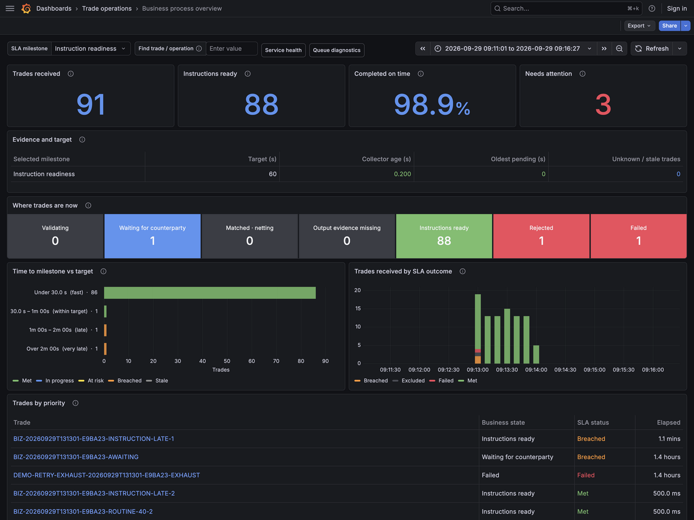
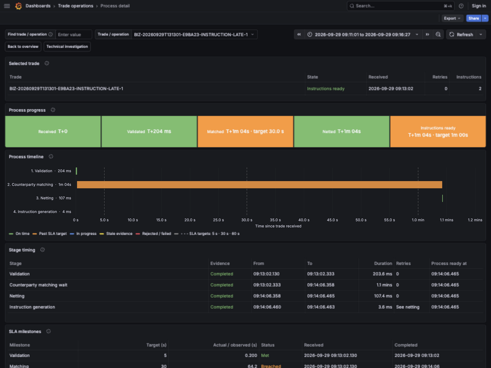

# Approach C dashboard screenshots

Captured from the running local Grafana at `http://localhost:3302` on September 29, 2026. These 19 screenshots cover all seven dashboard views. Numbered parts follow the page from top to bottom, with overlap. Tables and trace panels retain their normal internal scrolling; collapsed sections remain collapsed.

Dashboard interval: September 29, 2026, 09:11:01.973 to 09:16:27.425 America/New_York. The demo run is `20260929T131301-E9BA23`. Current-state and source-health panels report their state at capture time, even though the dashboard interval is historical.

The process detail selects the instruction SLA breach, operation `38cfcc56-22b8-4860-a3f9-4ebceeb7433a`. The investigation selects the recovered retry, operation `6fea7707-7081-4444-8d57-f48b47b3de65`.

The images preserve the observed local demo state, including unconfigured corporate sources, stale ODS status and empty diagnostic history. Browser viewport: 1600 × 1200. Saved PNG size: 1280 × 960.

| View | Screenshots | Dashboard |
| --- | --- | --- |
| Business process overview | [Part 1](01-business-process-overview-1.png) · [Part 2](01-business-process-overview-2.png) | [Open locally](http://localhost:3302/d/mocknet-c-business/business-process-overview?from=2026-09-29T13:11:01.973Z&to=2026-09-29T13:16:27.425Z&timezone=browser&orgId=1&var-policy=instructions&var-search=) |
| Process detail: instruction SLA breach | [Part 1](02-process-detail-1.png) · [Part 2](02-process-detail-2.png) | [Open locally](http://localhost:3302/d/mocknet-c-process/process-detail?from=2026-09-29T13:11:01.973Z&to=2026-09-29T13:16:27.425Z&var-operation=38cfcc56-22b8-4860-a3f9-4ebceeb7433a&timezone=browser&orgId=1&var-search=&var-policy=instructions&var-overview_from=1790687461973&var-overview_to=1790687787425) |
| Service evidence overview | [Part 1](03-service-evidence-overview-1.png) · [Part 2](03-service-evidence-overview-2.png) | [Open locally](http://localhost:3302/d/mocknet-c-overview/service-evidence-overview?from=2026-09-29T13:11:01.973Z&to=2026-09-29T13:16:27.425Z&timezone=browser&orgId=1&var-stage=$__all&var-search=) |
| Queue journal diagnostics | [Part 1](04-queue-journal-diagnostics-1.png) · [Part 2](04-queue-journal-diagnostics-2.png) | [Open locally](http://localhost:3302/d/mocknet-c-queues/queue-journal-diagnostics?from=2026-09-29T13:11:01.973Z&to=2026-09-29T13:16:27.425Z&timezone=browser&orgId=1&var-stage=$__all&var-search=) |
| Operation investigation: recovered retry | [Part 1](05-operation-investigation-1.png) · [Part 2](05-operation-investigation-2.png) · [Part 3](05-operation-investigation-3.png) · [Part 4](05-operation-investigation-4.png) · [Part 5](05-operation-investigation-5.png) | [Open locally](http://localhost:3302/d/mocknet-c-investigation/operation-investigation?from=2026-09-29T13:11:01.973Z&to=2026-09-29T13:16:27.425Z&var-operation=6fea7707-7081-4444-8d57-f48b47b3de65&timezone=browser&orgId=1&var-search=&var-trace_id=1d8ba8b95a35563ab19697c8783c38da) |
| Sources and diagnostics | [Part 1](06-sources-and-diagnostics-1.png) · [Part 2](06-sources-and-diagnostics-2.png) | [Open locally](http://localhost:3302/d/mocknet-c-sources/sources-and-diagnostics?from=2026-09-29T13:11:01.973Z&to=2026-09-29T13:16:27.425Z&timezone=browser&orgId=1) |
| Runtime and queue metrics | [Part 1](07-runtime-and-queue-metrics-1.png) · [Part 2](07-runtime-and-queue-metrics-2.png) · [Part 3](07-runtime-and-queue-metrics-3.png) · [Part 4](07-runtime-and-queue-metrics-4.png) | [Open locally](http://localhost:3302/d/mocknet-c-runtime/runtime-and-queue-metrics?from=2026-09-29T13:11:01.973Z&to=2026-09-29T13:16:27.425Z&timezone=browser&orgId=1&var-environment=$__all&var-service=$__all&var-version=$__all&var-app_instance=$__all&var-stage=$__all) |

