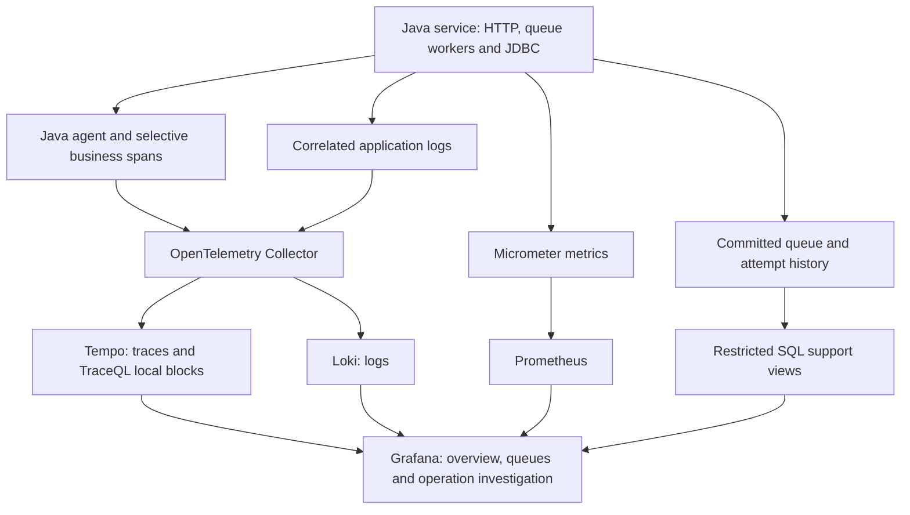
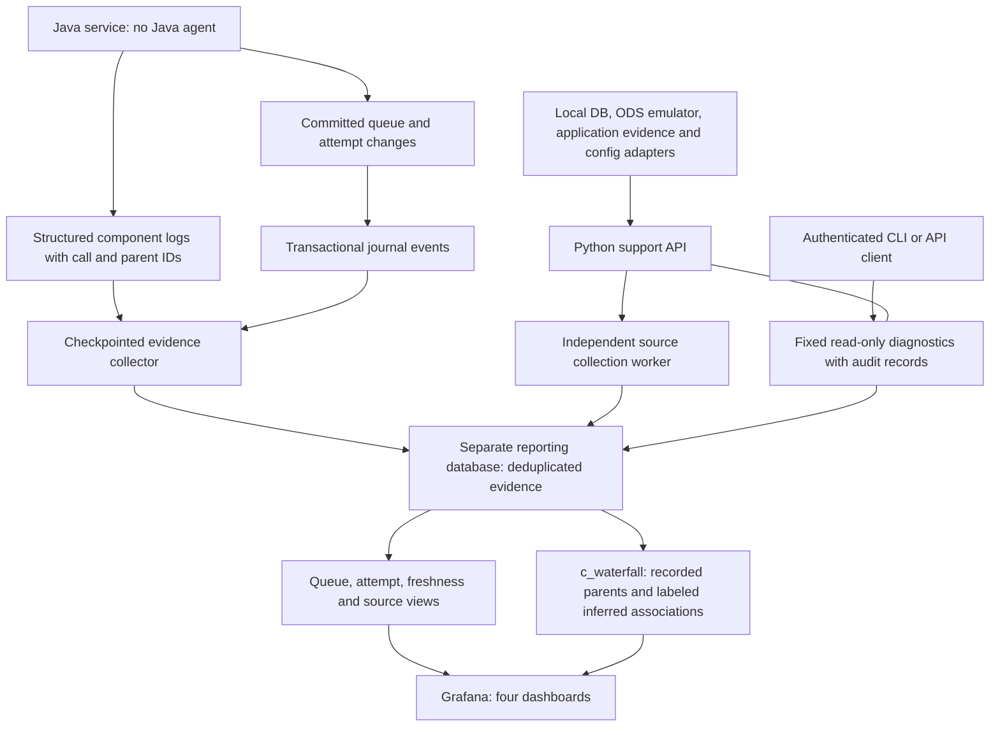

# Observability implementation and findings

## Summary

This project compares three ways to support incident diagnosis in the Mocknet Java service. Each approach processes the same kind of trade workload through a PostgreSQL-backed queue. Grafana provides service, queue and operation investigation views.

**Approach A is the recommended basis for L3 support.** It combines business identifiers, durable queue history, runtime metrics, dependency spans and correlated logs. Approach B requires the fewest application changes but cannot diagnose business or queue failures on its own. Approach C is useful when agents are prohibited and sufficiently detailed logs and journals are available, but it requires a custom collection and reconstruction system.

C now has the same native Grafana waterfall renderer as A. Equal visual quality does not make the underlying evidence equivalent: C cannot reveal an SQL call or dependency that its source records never captured.

For the remaining work from this repository to a controlled hosted pilot, budget **15–25 person-days for A** or **25–45 person-days for C**. These are engineering planning estimates, not recorded implementation time or a production delivery commitment. The [effort breakdown](#engineering-effort-a-versus-c) defines the scope, assumptions and additional integration work. Grafana is retained; alarms and notifications are outside the scope.

These are local implementation and incident exercises. They do not certify production capacity, full distributed coverage, external settlement, or a general performance winner.

## Service and workload

The Spring Boot service accepts XML trade submissions, validates and matches trades, calculates netting and generates local settlement instructions. Work moves through ingestion, matching and netting. Settlement instruction generation runs inside netting; the separate settlement queue is normally idle. Dead-letter messages remain available for investigation.

The demo profile configures 24 worker slots and a 16-connection application database pool. Queue polling uses a 250 ms interval. Operation IDs, message IDs and durable processing attempts support correlation across retries and restarts. HTTP 202 means admission, not completed processing.

The continuous feeder submits one request per second per running approach. Its mix includes matched pairs, unmatched trades, slow processing, retry recovery, exhausted retries, business rejection and malformed input. It pauses at configured backlog, retained-admission and free-disk limits. It does not automatically retry an uncertain POST.

This is a PostgreSQL-backed mock queue. The journal implementation has not been validated against a real MQ product. An actual broker deployment needs a supported activity-record adapter and explicit message/correlation mappings.

## Approach A: OpenTelemetry, metrics and durable history

### Implementation

- The OpenTelemetry Java agent supplies HTTP and JDBC instrumentation. Application spans describe components and queue processing; context travels with queued work.
- Micrometer provides runtime, worker, connection-pool, queue, latency and outcome metrics. The Collector exports traces to Tempo and logs to Loki. Prometheus stores metrics.
- Durable queue and attempt tables record outcomes, retry reasons, workers and operation relationships. Grafana queries restricted SQL support views for current state and persisted history.
- Three dashboards cover service overview, queue/stage diagnostics and operation investigation. Investigation selects the originating trace, renders its waterfall, and correlates logs by trace and operation IDs.
- Trace-to-logs links retain the selected trace and a padded span time range. The local Grafana Viewer configuration permits Explore access while dashboard write permissions remain absent. This setting is deprecated upstream; a production deployment needs authenticated support users and an appropriate Explore permission for its Grafana edition.
- Application launchers copy JARs to stable runtime paths. Building another approach no longer replaces a JAR used by a running JVM.

Main files: `mocknet/src/main/java/com/cit/mocknet/observability/`, `QueueMessageTracing.java`, `ComponentTracingAspect.java`, `observability/compose.yaml`, `observability/postgres/support-views.sql`, and `script/build-mocknet-dashboards.py`.

### Findings

A provides the most complete investigation path: affected operation, queue disposition, attempt and failure reason, component timing, JDBC call and related logs. Durable history remains useful when a trace is delayed or has expired.

Testing exposed two important operational issues. The running-JAR replacement problem was fixed by isolating runtime artifacts. As retained data grew, two overview queries reached their five-second timeout. Indexes on operation IDs and matched-trade legs, plus an indexed related-operation lookup, removed the timeout in subsequent checks.

A browser test reproduced a related-logs link redirecting to Home because the Viewer session lacked Explore access. The configuration fix was verified through the actual span link: four records showed two ingestion retries, successful ingestion and matching for the selected incident.

A now limits default custom spans to controllers and explicit business boundaries using `@TraceBoundary`. HTTP, queue consumer and JDBC spans remain; optional verbose component tracing is available for investigation. Comparable matched traces fell from 112 to 57 spans while retaining all 45 JDBC spans. This reduced wrapper noise, not executed SQL or business counts. Production work still includes sampling policy and retained failure evidence. A method return or a successful local queue disposition does not establish external settlement. See the [trace and counting review](observability/approach-a/TRACE-DATA-REVIEW.md).

The built-in Traces Drilldown also requires Tempo's TraceQL metrics support. Its earlier `empty ring` error was fixed by enabling the `local-blocks` processor and persistent generator storage. Root-span mode shows entry points; select All spans to inspect internal structure. Service structure aggregates multiple traces, whereas the operation waterfall shows a selected trace. The one deployed Java service remains `mocknet`; ingestion, matching and netting are internal stages. See [Grafana's root/all span explanation](https://grafana.com/docs/grafana/latest/visualizations/simplified-exploration/traces/investigate/choose-span-data/).

## Approach B: strictly JVM runtime metrics

### Implementation

- A separate Java-agent configuration disables tracing, logging and general application instrumentation. Only runtime telemetry is enabled.
- Its own Collector accepts the runtime metrics and exports them to a separate Prometheus instance. Trace and log receiver routes are absent.
- Three dashboards show JVM overview, runtime diagnostics and resource investigation. They include CPU, heap, allocation, GC, threads, loaded classes, buffers and file descriptors.
- Business IDs, queue metrics, HTTP metrics, database metrics, spans and trace-derived metrics are outside B's exported signal set.

Main files: `script/mocknet-approach-b.sh`, `observability/approach-b/`, and `script/build-mocknet-approach-b.py`.

### Findings

A recorded exercise admitted 373 requests, including concurrent load, a paused consumer, rejected trades and exhausted retries. All admissions returned HTTP 202 and an all-zero trace ID.

During the consumer pause, 27 messages accumulated while sampled JVM CPU was about 0.32%. After injected business failures, dead letters increased while CPU was about 0.48%. Database connection pressure made the database-backed status endpoint fail even though runtime metrics remained available.

Those queue counts came from the experiment's separate ground-truth recorder; B did not display them. The exercise demonstrates that low CPU and a reachable metrics pipeline do not establish business health. B is suitable as a runtime diagnostic layer, not a complete L3 service dashboard.

B is stopped at the user's request. Its database volumes, dashboard definitions and recorded findings are retained. Its earlier query and metric-boundary checks are historical validation, not a claim that B is currently running.

## Approach C: support backend, source adapters and reconstructed evidence

### Implementation

- C now adapts the Citrix Approach C draft with a Python/Gunicorn REST backend while retaining Grafana. Database, delayed local ODS export, application evidence and configuration adapters feed the reporting store. COR, LG2 and UDG are explicitly not connected; local substitutes do not establish their schemas or runtime behavior.
- An independent collection worker prevents REST source outages from blocking log/journal ingestion. Source age, last successful read, errors and last known values appear in a fourth Grafana dashboard, "Sources and L3 diagnostics".
- The backend supports authenticated read-only application health, queue and operation diagnostics. Requests and results are recorded before/after execution. Distinct local reader/operator tokens and restricted database roles enforce access. Enterprise SSO is not configured. Alarm and notification work is excluded.
- The application runs without a Java agent and with application tracing disabled. A logging aspect emits structured component start, end and failure records.
- Records carry call/parent IDs, operation/message IDs, stage, worker, timestamps, monotonic duration and exception classes. Empty queue polls are not logged; failed claims identify their queue without inventing an operation association.
- Transaction-local database triggers journal allowed queue and attempt metadata. Payloads, exception messages and OpenTelemetry trace/span fields are excluded from this journal.
- A checkpointed Python collector pools component logs and committed journals into the separate `telemetry_c` reporting database. Grafana's read-only role cannot connect to the application database.
- Journal records are committed to reporting before source acknowledgement. Unique event IDs make replay idempotent. Collection does not rely on a sequence high-water mark, so lower sequence numbers committed late are still collected.
- Log checkpoints and inserts commit together. Partial lines wait for completion; rotated files retain identity. Malformed records are quarantined by position and hash. Retention removes older detailed evidence while preserving latest reconstructed queue state.
- `c_waterfall(operation_id)` converts reporting records into the native Grafana trace-frame format at query time. No Tempo instance or extra application instrumentation supplies C's waterfall.

Main files: `ComponentJournalAspect.java`, `observability/approach-c/journal.sql`, `reporting.sql`, `waterfall.sql`, `logback.xml`, `script/mocknet-c-reporter.py`, `script/build-mocknet-approach-c.py`, and the [support backend](observability/approach-c/backend/README.md) in `observability/approach-c/backend/`.

### Investigation experience

C's waterfall automatically fits the selected operation, independent of the dashboard time window. It shows nested and collapsible component calls, MQ attempts, retry delay, ready wait and processing intervals. Expanded rows expose original source IDs, worker, outcome, failure reason and evidence provenance.

Recorded parent-call IDs determine component nesting. Top-level calls join an attempt only when message ID, worker and time interval identify exactly one candidate. This inferred association is labeled. Missing parents, missing starts, open/missing ends and clock inconsistencies remain explicit.

The renderer calls these display rows spans and displays deterministic reconstruction IDs. These are not emitted OpenTelemetry IDs. Stage/evidence groups supply its service colors; the displayed service count is not a count of deployed services. Critical-path calculations describe only the reconstructed tree.

The retry example rendered 28 rows and two approximately 500 ms backoff intervals. Seven recorded scenarios, including a roughly 20-second queue stall, were checked. Waterfall queries took approximately 0.2–0.3 seconds in that local snapshot. Those timings are not a production benchmark.

### Findings

The main C incident exercise admitted 128 deliberate requests alongside its background stream. It covered stalled ingestion, concurrent load, rejection, exhausted retries, database pressure and collector outage/recovery.

A 12-second collector outage left newly processed operations absent from reporting until collection resumed. Replay, late commits, rollback, partial lines, duplicate lines, rotation, missing ends and quarantine behavior were exercised. A separate pressure check recorded failed claims in all four worker stages with transaction/connection exception classes.

C can reconstruct useful transaction and queue history. It still cannot supply unlogged SQL calls, JVM resource behavior or unobserved external dependencies. It reuses operation IDs and durable attempt/context structures developed for A, so it is not an independent zero-change instrumentation baseline.

The asynchronous logger can block application threads when full. Process termination, disk failure or rotation before collection can lose evidence. Gap counters cannot detect every missing tail or entirely lost file. The collector, retention, reconstruction rules, schema evolution and broker adapters require ongoing ownership.

## Engineering effort: A versus C

### Estimate basis and scope

The estimates below cover **remaining engineering work using the existing implementation**, through a controlled hosted pilot. A person-day means eight hours of combined engineering, review and validation work. Five person-days equal one person-week. These are judgment-based ranges derived from the work packages below, not timesheets, vendor estimates or statistical confidence intervals.

Assumptions:

- One existing Spring Boot service and its current PostgreSQL queue, one hosted environment, and the current Grafana investigation experience. This is not a rollout across the whole corporate estate.
- Reuse the existing operation/message/attempt IDs, durable history, instrumentation, dashboards and tests. Rebuilding them from scratch is not included. A legacy service without those contracts needs a separate estimate.
- Engineers know Java, SQL and observability; C also needs Python collection/backend experience. An approved deployment platform, identity provider, database and storage are available. Integration/configuration effort is included; provisioning or access waiting time is excluded.
- The pilot uses the current source contracts. C includes its existing support API and four local adapters, including the ODS emulator. Real ODS, COR, LG2, UDG and real broker integration are additional work.
- The pilot has bounded load, retention and recovery targets agreed at kickoff. Multi-region operation, high availability, regulatory certification, a replacement UI, alarms and notifications are excluded.

### Remaining work breakdown

Each column is an alternative project estimate. Shared work appears once within each alternative; do not add A and C totals together when choosing one approach. The ranges include ordinary implementation rework within this scope, without an additional hidden contingency percentage.

| Work package | A: person-days | C: person-days | Work to finish for the pilot |
| --- | ---: | ---: | --- |
| Evidence contract and application integration | 2–3 | 3–5 | Validate IDs, async boundaries, outcomes and field allowlists in the hosted service. A checks agent compatibility and selective spans. C versions log/journal contracts and validates pairing and trigger permissions. |
| Collection and storage deployment | 2–4 | 5–9 | A configures Collector, Tempo, Loki and Prometheus retention/export recovery. C packages collector/backend workers, migrations, checkpoints, replay, quarantine and source freshness for unattended operation. |
| Reporting and Grafana acceptance | 2–3 | 4–7 | Validate counts, units, selected/related operations and retained-volume queries. A includes native traces, logs and built-in Drilldown. C additionally verifies reconstruction provenance, partial evidence and source diagnostics. |
| Access control and release automation | 3–5 | 4–7 | Managed login, TLS, private datasource access, credential rotation, reproducible deployment and rollback. C also maps individual API users to reader/operator roles and diagnostic audit records. |
| Failure, capacity and recovery validation | 4–6 | 6–11 | Establish ingestion lag, query latency, storage growth and application overhead at agreed load. Exercise restarts, dependency outages and restore. C additionally proves replay/checkpoint behavior across process kills, rotation, partial records and late commits. |
| Documentation and support handover | 2–4 | 3–6 | Record deployment/recovery procedures, evidence limitations and diagnostic examples; run support-user acceptance. C includes adapter/schema changes, reprocessing and reconstruction troubleshooting. |
| **Total remaining pilot effort** | **15–25** | **25–45** | **A: 3–5 person-weeks. C: 5–9 person-weeks.** |

With one dedicated engineer, these correspond to roughly **3–5 working weeks for A** and **5–9 for C**, plus external waits. With two engineers, an illustrative schedule is **2–4 weeks for A** and **4–6 for C**, assuming about 1.5 effective full-time contributors after coordination and sequential work. More people do not remove contract, access or validation dependencies. These schedules are staffing scenarios, not promised dates.

The low ends assume the approved platform fits the existing deployment and the first acceptance run finds small issues. The high ends allow for migration/recovery defects, query tuning and access integration rework. New source contracts or architecture changes fall outside both ends. Re-estimate after the first work package confirms those assumptions. A labor budget is person-days multiplied by the team's loaded daily rate; hosting, storage and licensing costs are separate.

### Why C needs more engineering

A reuses a standard instrumentation and storage ecosystem for HTTP/JDBC timing, trace relationships, runtime metrics and log correlation. Our custom work remains the business context, queue history, dashboard queries and deployment. Selective instrumentation controls also exist in the [OpenTelemetry Java agent](https://opentelemetry.io/docs/zero-code/java/agent/disable/).

C owns an additional evidence-processing system: event schemas, file identity, transactional journal extraction, acknowledgement ordering, replay, late records, missing evidence, reconstruction, retention and adapter/API behavior. An apparently simple logging change creates downstream compatibility obligations whenever application methods, queue schemas or source formats change.

The totals compare the **current A and C designs**, not identical feature sets. C includes source-adapter/API functions that A does not currently expose. If those functions are required with A, reuse C's backend and estimate their hosted integration separately; they are not inherently tied to reconstruction. Conversely, C's estimate does not buy JDBC detail or JVM metrics that its configured sources do not capture. Requiring those signals changes C's design and needs a new estimate.

### Work that needs separate sizing

| Additional requirement | Why it is outside the pilot estimate | Input needed before estimating |
| --- | --- | --- |
| Real MQ and cross-service processing | The local PostgreSQL queue does not validate broker context propagation, activity records, redelivery or transaction semantics. Both approaches need this work. | Broker/product version, supported interfaces, sample records, transaction model and a test environment. A needs context propagation; C needs a supported journal/activity adapter. |
| Real ODS, COR, LG2 or UDG | The local source adapters establish mechanics, not external schemas, access rights or freshness guarantees. | Named source owner, sample data/API, stable keys, timestamp semantics, volume, access method and allowed queries. Size each adapter and its acceptance tests separately. |
| More applications or absent business IDs | Instrumentation compatibility and correlation are application-specific. C cannot reconstruct missing identities reliably from timestamps alone. | Per-service entry/exit points, messaging boundaries, IDs already available and required source changes. |
| Production availability and retention | Required topology and recovery effort depend on failure tolerance and retained volume. | Availability target, recovery time/data-loss limits, retention, workload and platform services already operated by the team. |

The report therefore gives a pilot estimate, not a fixed production price. A production estimate follows the pilot evidence and these contracts. Removing the agent does not remove the need for application-owner, database-owner or security review.

## Technical implementation and delivery

### Architecture flows

Arrows below show evidence flowing toward the UI. Grafana issues read queries to the stores; it does not own business correlation or execute the application's processing stages.

**A: record trace context and query committed business history**



**C: collect source evidence, preserve provenance and reconstruct for display**



Both diagrams represent observability components, not a discovered network of business microservices. In C, database/ODS snapshots enrich source diagnostics; they do not invent missing component calls. Grafana displays diagnostic results, while an authenticated CLI/API client initiates the fixed diagnostics.

### Implementation responsibilities

| Area | A implementation | C implementation | Primary owner |
| --- | --- | --- | --- |
| Application evidence | `ComponentTracingAspect` and `@TraceBoundary` record meaningful custom spans; `QueueMessageTracing` carries queue context; agent captures HTTP/JDBC. | `ComponentJournalAspect` emits correlated start/end/failure records; journal triggers capture committed queue changes. | Java/application engineer |
| Reliable collection | Collector export queues and standard telemetry backends; explicitly size retention and sampling. Tempo local blocks support Drilldown metrics. | `mocknet-c-reporter.py` commits reporting before acknowledgement, checkpoints files, quarantines malformed records and collects sources independently. | Platform engineer for A; Python/data engineer with platform support for C |
| Data model and queries | Restricted `support-views.sql` plus Micrometer counters published after commit. | `reporting.sql` projects latest entity state; `waterfall.sql` creates display spans without claiming emitted trace IDs. | SQL/data engineer with application owner |
| Support access | Grafana permissions and read-only datasource roles; the pilot adds managed login. | Same Grafana controls plus Flask/Gunicorn API and audited fixed diagnostics; the pilot replaces local shared tokens with individual reader/operator identity. | Platform/identity engineer |
| Visualization | `build-mocknet-dashboards.py`: metric overview, queue diagnostics and exact trace/log links. | `build-mocknet-approach-c.py`: reconstruction, queue state and source freshness, with uncertainty visible. | Observability engineer and L3 reviewer |
| Release and recovery | Versioned agent/backend configuration, migration order, export recovery and stable application artifacts. | Also version event contracts, preserve checkpoint compatibility and prove reprocessing after upgrades. | Release owner with the component owners above |

These are responsibilities, not six required hires. A practical small team combines a Java/observability engineer with a platform engineer. C also needs explicit Python/SQL ownership; that expertise can be held by the same people if available.

### Counting and visualization acceptance rules

1. **Business outcomes come from committed records.** One operation ID counts one admission; one attempt ID counts one attempt. A two-retry recovery has three attempts, not three operations. A's counters update after commit; rollback adds no completed outcome.
2. **Observations are not extra transactions.** Parent and child spans, logs and journals may describe the same work. Do not add their counts as business throughput or sum nested durations. For C, a component start/end pair is one call and replaying an event ID adds no evidence row.
3. **Separate infrastructure traffic from business views.** `/actuator/prometheus` scrapes and `/api/status` requests can appear in unfiltered trace browsing. A business investigation must select the relevant operation/route. Root-span rate, all-span rate and committed business outcomes measure different things.
4. **Preserve timing meaning.** Attempt elapsed, consumer execution, ready wait and retry delay have different boundaries. Missing completion stays unknown. Selected/related trade legs remain labeled, and shared related work appears once.
5. **Show evidence limitations.** Trace sampling/retention can leave business history without a trace. C can be stale or incomplete and must show source time, collection time, last success and association provenance. Equal waterfall rendering does not establish equal source coverage.
6. **Use valid aggregation.** Shared-database queue gauges use the maximum across fresh, healthy exporters, not their sum. Independent databases need distinct aggregation dimensions. Histogram buckets aggregate before p95 calculation; A and C's different percentile methods must not be presented as a matched benchmark.

The [trace and data review](observability/approach-a/TRACE-DATA-REVIEW.md) records the local evidence for these rules. The hosted pilot must repeat the checks in its own deployment, including the built-in Drilldown and actual support-user permissions.

### Delivery sequence and exit criteria

| Step | Deliverable | Exit criterion |
| --- | --- | --- |
| 1. Agree the evidence contract | IDs, outcomes, sensitive-field allowlists, required sources and numeric pilot targets for freshness, query latency, load and recovery. | Application and support owners can explain one success, rejection, retry and missing-evidence case using the agreed definitions. Re-estimate if assumptions change. |
| 2. Deploy privately | Versioned artifacts, database migrations, credentials, TLS and role mapping in the pilot environment. | Repeatable deployment/rollback; support users can read authorized evidence; unauthorized datasource/API access is rejected. |
| 3. Reconcile and inspect | Deterministic operation/attempt audit and Grafana walkthrough of successful, failed, stalled and related operations. | Counts reconcile with committed ground truth; both native waterfalls work; A trace/log links resolve; C exposes source provenance, replay adds no duplicates and missing evidence remains visible. |
| 4. Prove recovery and capacity | Retained-volume and failure exercises, storage/cost measurements, backup/restore evidence. | Meets the targets agreed in step 1; outage recovery does not silently invent successes or conceal evidence loss. C additionally passes late-commit, rotation and checkpoint recovery cases. |
| 5. Handover | Named component owners, deployment/recovery instructions and known coverage limits. | L3 users reproduce the incident walkthrough without developer assistance. |

Steps 2 and parts of 3 can overlap once the contract is settled; recovery acceptance depends on the deployed pipeline. These steps organize the work packages above and are not additional effort to add to the totals.

### Ongoing ownership and recommendation

A still needs agent/backend upgrades, sampling and retention tuning, credential maintenance, database query tuning and regression checks for Grafana/plugins. C needs those applicable platform/data tasks plus log/journal contract migrations, adapter changes, checkpoint/replay repair, reconstruction regressions and evidence-gap investigation. Recurring effort has not been measured; a credible monthly budget needs pilot data on volume, incidents and source change frequency.

**Choose A for this service when the agent is allowed.** It offers broader diagnosis with less custom evidence-processing software. Choose C when agent restrictions or an existing source/reporting estate justify its extra ownership, and its coverage meets the support need. If the useful part of the Citrix design is the support API and source adapters, those can complement A without replacing its tracing. Grafana remains the UI in either case. Alarm and notification implementation is excluded from all estimates and delivery steps.

## Measured application cost

The controlled local comparison used the same application artifact and ran in order A, B, C, C, B, A. Each run used a fresh database, Java 17, 128 MiB initial/512 MiB maximum heap, 24 workers, 16 database connections, 80 warmup requests and 400 measured requests at concurrency 16. Every run finished with all 480 trades NETTED.

Medians of two runs per approach:

| Approach | HTTP admission p95 | Submit and drain | JVM CPU time | Peak sampled JVM RSS |
| --- | ---: | ---: | ---: | ---: |
| A | 22.00 ms | 3.68 s | 10.49 s | 524.84 MiB |
| B | 24.78 ms | 3.85 s | 10.07 s | 616.30 MiB |
| C | 31.60 ms | 3.66 s | 9.08 s | 402.65 MiB |

C wrote approximately 22.3 KiB of component logs and 9.1 KiB of source journal allocation per trade, before the reporting copy. A separate live C reporter observation measured about 26 MiB RSS and 0.13 CPU seconds over 20 seconds.

These measurements exclude a controlled comparison of total collector/database/Grafana cost. C's collector did not consume the isolated benchmark databases. Other live feeds ran on the shared host, contention retries varied, and there were only two samples per approach. The later C waterfall and support backend, A's selective span reduction and Tempo Drilldown configuration were not part of the original benchmark. C's smaller sampled JVM footprint does not establish the lowest total system cost. These runtime measurements are not the basis for the person-day estimates above.

## Laptop resource findings

A separate 22.66-second observation measured Docker's VM at 124% CPU, where 100% represents one logical core. A's PostgreSQL container used about 38–40% CPU in snapshots. Container CPU is included in VM CPU and must not be added to it. All demo containers, including B at that time, reported about 2.4 GiB memory; native application JVMs added roughly 0.7 GiB RSS.

The 24 GiB host had approximately 9.22 GiB physically occupied by memory compression and about 8.2 GiB of swap in use. The sample recorded 11.4 MiB of swap-ins and no swap-outs. No thermal warning was reported; no direct temperature measurement was taken. An unrelated process also consumed nearly one core and was removed at the user's request. These observations do not attribute all laptop heat to observability.

B was subsequently stopped. A and C continue at one admission per second. Lower idle polling, less frequent dashboard refresh and bounded retained data are practical tuning candidates, but a before/after controlled measurement is still needed to quantify their effect.

## Validation

Historical implementation validation passed 31 Java tests and 87 dashboard queries across A, B and C. After the native C waterfall change, all 20 C queries and 14 reconstruction contract checks passed. The contract test uses rolled-back reporting fixtures and verifies the actual Grafana database role.

Pre-push validation on September 15, 2026:

| Check | Result |
| --- | --- |
| Java, `mvn -q -f mocknet/pom.xml test` | 31 passed, zero failures/errors |
| Trace viewer, `bun test test/tool/traceview.test.ts` | 4 passed, zero failures |
| Live A dashboard queries | 39 passed |
| Live C dashboard queries | 20 passed, including native waterfall frame validation |
| C reconstruction contract | 14 checks passed; fixtures rolled back |
| Full CLI suite, `bun test` | 459 passed, 1 skipped, 101 failed |
| TypeScript, `bun run typecheck` | 44 compiler errors |

The full CLI suite and TypeScript checks were also run against unchanged base commit `e96ac84` in an isolated checkout using the same installed dependencies. It produced the same 459/1/101 test counts, the same failing test names, and the same 44 compiler diagnostics after normalizing line numbers. There were no additional failures in those comparisons. The repository-wide checks remain failing; these changes do not claim to repair the existing CLI configuration/skill-discovery failures or TypeScript errors.

Whitespace and syntax checks passed. The staged text scan found no remaining references to the removed organization name or its telemetry namespace. Local databases, Python cache files and generated secrets are excluded from this commit.

Subsequent recorded validation on September 15 covered the narrower A instrumentation and data corrections: 15 relevant Java tests, 40 A datasource queries, 24 C panel queries and 16 C waterfall contract checks passed. The isolated A audit reconciled six operations and 13 committed attempts with metric increments and consumer spans. Five TraceQL metrics queries and the Grafana datasource API then passed after the Drilldown configuration fix. These are prior local validation results documented in the [review](observability/approach-a/TRACE-DATA-REVIEW.md), not a fresh full-suite run for this documentation update or hosted-pilot certification.

## Run and inspect

```bash
# Start A and initialize local generated secrets.
bash script/mocknet-grafana.sh start
bash script/mocknet-grafana.sh stream-start

# Start C with a separate backend, reporting store and Grafana.
bash script/mocknet-approach-c.sh start
bash script/mocknet-approach-c.sh stream-start

# Validate running A/C dashboards and C reconstruction.
python3 script/check-mocknet-dashboards.py
.bootstrap/observability/approach-c/venv/bin/python script/check-mocknet-approach-c.py
.bootstrap/observability/approach-c/venv/bin/python script/check-mocknet-c-waterfall.py
```

| Approach | Grafana | Application | State at report preparation |
| --- | --- | --- | --- |
| A | [localhost:3300](http://localhost:3300/d/mocknet-traces?from=now-15m&to=now) | localhost:18081 | Running with feed |
| B | Dashboards on A's Grafana | localhost:18091 | Stopped |
| C | [localhost:3302](http://localhost:3302/d/mocknet-c-overview?from=now-15m&to=now) | localhost:18101 | Running with feed |

Use `stream-stop` to stop only a feed and `stop` to stop its stack. Stop commands preserve database volumes. Local generated secrets and raw runtime evidence are excluded from Git under `.bootstrap/`; report summaries and reproducible scripts are included. Historical Grafana links depend on retained data and eventually expire.

The current source uses the neutral telemetry key `component.stage` and pipeline terminology consistently across instrumentation, trace viewers, examples and tests. Already-running binaries and previously collected records keep their original metadata until restart or retention expiry. This commit changes the current repository tree, not prior Git history.

## Production work remaining

- Authenticate support users, restrict datasource access and use managed credentials, TLS and an audited deployment process.
- Validate a real broker adapter, message correlation across services, clock behavior, duplicate delivery and abandoned claims.
- Establish sampling, sensitive-field allowlists, retention, backup and restore requirements. Do not use high-cardinality operation IDs as metric labels.
- Load-test retained data volumes, query plans, collector outages, process kills and disk-full behavior. Add collector redundancy or partitioned projections where required.
- Measure end-to-end cost and diagnostic completeness with comparable signal coverage. B's lower diagnostic coverage makes a raw overhead comparison insufficient.

Alarm and notification work is excluded at the user's request. The engineering estimate covers the bounded pilot above; this production list must be sized against the actual deployment and source contracts.

## Design references

- [OpenTelemetry Java instrumentation controls](https://opentelemetry.io/docs/zero-code/java/agent/disable/)
- [OpenTelemetry log data model](https://opentelemetry.io/docs/specs/otel/logs/data-model/)
- [Grafana trace frame contract](https://github.com/grafana/grafana/blob/v12.4.1/packages/grafana-data/src/types/trace.ts)
- [Grafana log-label guidance](https://grafana.com/docs/loki/latest/get-started/labels/bp-labels/)
- [IBM MQ application activity trace](https://www.ibm.com/docs/en/ibm-mq/10.0.x?topic=network-application-activity-trace)
- [Logback asynchronous logging](https://logback.qos.ch/manual/appenders-async-sift.html)

Further details: [approach comparison](observability/APPROACH-COMPARISON.md), [A implementation](observability/approach-a/README.md), [B validation](observability/approach-b/VALIDATION.md), and [C implementation](observability/approach-c/README.md).
