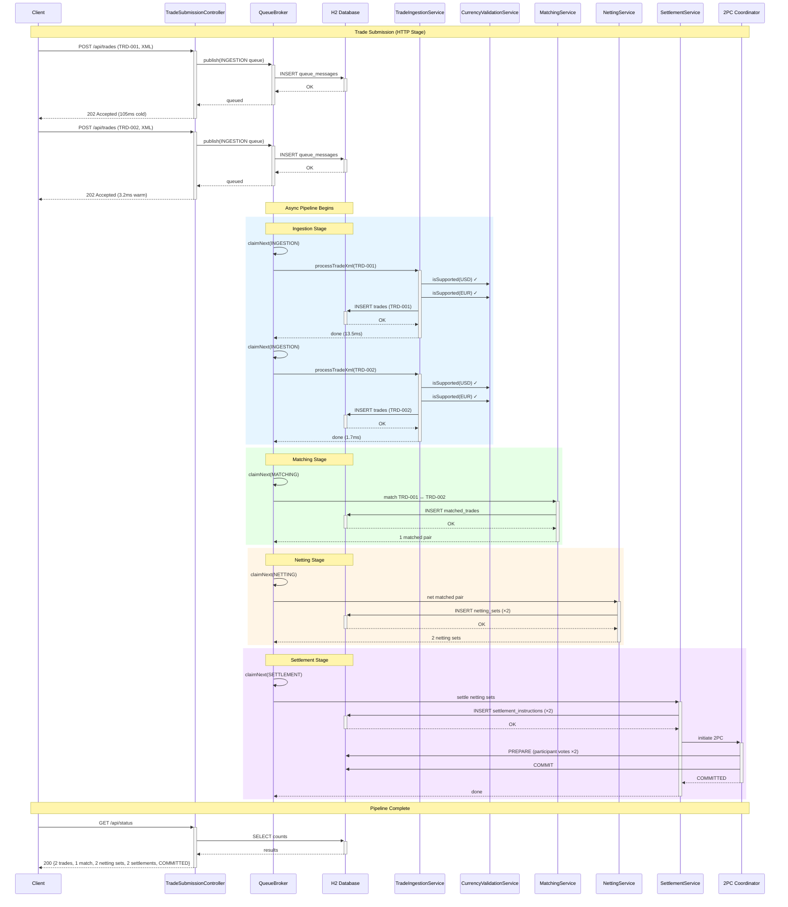

# Mocknet CLS Pipeline Trace

Each colored `rect` corresponds to a separate trace root -- trace context does not propagate across the in-memory queue boundaries, which is why traceview sees individual traces per stage rather than one end-to-end span tree.
